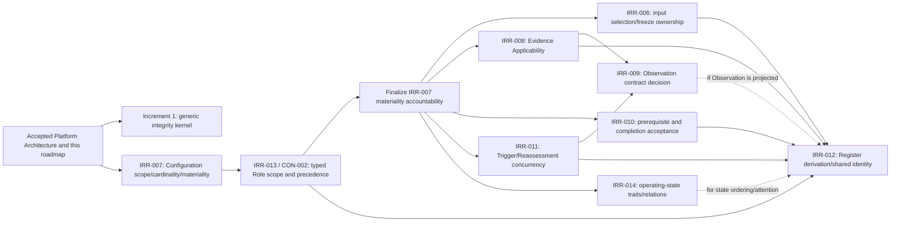

# PAIM Implementation Sequence and P1 Gates v0.1

## 1. Purpose and baseline

This artifact converts the accepted PAIM Platform Architecture v0.1 into a controlled implementation sequence. It defines when each planned increment may begin, which unresolved P1 findings are hard prerequisites, which behavior must remain unavailable until clarification, which specification owns each decision, and what evidence opens each gate.

The baseline is PAIM `main` at merge commit `836b9d6c6143e4fe315df71cf0491c3a12c94252`.

Governing sources are:

- `PAIM_PLATFORM_ARCHITECTURE_v0.1.md`, especially §§20 and 23;
- `../system/testing/PAIM_CODEX_IMPLEMENTATION_READINESS_REVIEW_v0.1.md`, especially §§3, 10, and 11;
- `../system/testing/PAIM_CODEX_IMPLEMENTATION_READINESS_REREVIEW_v0.1.md`, especially §§10–12;
- `../system/specifications/PAIM_SYSTEM_RECORD_AND_DECISION_INTEGRITY_SPEC_v0.1.md`, especially §§2–12; and
- the current record-family specifications under `../system/specifications/`.

This is a sequencing and gate-control artifact only. It does not resolve any P1 question, authorize code, select a technology stack, or amend a governing specification.

### 1.1 Gate rule

An implementation increment may open only when:

1. every hard P1 prerequisite for its authorized scope is resolved in accepted governing specifications;
2. every inherited prerequisite increment has passed its acceptance gate;
3. any still-deferred P1 behavior is explicitly excluded or represented as blocked/unresolved;
4. the increment has its own bounded GitHub issue and acceptance evidence;
5. technology decisions needed for that increment have been accepted separately; and
6. the work does not silently implement a human PAIM design decision through software convenience.

No later increment opens automatically because an earlier increment merges.

### 1.2 Gate-status vocabulary

| Status | Meaning |
|---|---|
| `PLANNING ONLY` | The increment defines or accepts sequencing; it authorizes no code. |
| `P1-CLEAR / NOT AUTHORIZED` | No unresolved P1 blocks the bounded semantic scope, but a separate accepted implementation issue is still required. |
| `CLOSED — P1 GATE` | At least one named P1 must be resolved before the full increment may begin. |
| `CLOSED — UPSTREAM GATE` | Required earlier implementation increments or their accepted specifications are incomplete. |
| `CONDITIONAL SUBSCOPE ONLY` | A narrower scope may proceed if it excludes named unresolved behavior; the full increment remains closed. |

## 2. Implementation increments from Platform Architecture v0.1

The roadmap preserves the ten increments in Platform Architecture §23.

| Increment | Planned outcome | Current gate status |
|---|---|---|
| 0 — architecture acceptance and P1 sequencing | Accepted roadmap, P1 hardening order, decision-record/conformance approach | `PLANNING ONLY` — completed only when this artifact is accepted; no code authorized |
| 1 — platform foundation and integrity kernel | Technology foundation plus common identity/version/history/currentness/point-in-time/audit seams | `P1-CLEAR / NOT AUTHORIZED` — no P1 semantic prerequisite; separate technology and code issues required |
| 2 — Case, Configuration, lifecycle, and Roles foundation | Case/Configuration records, lifecycle engine, Role Assignment/accountability | `CLOSED — P1 GATE` — IRR-007 and IRR-013/CON-002 |
| 3 — Evidence, Authority, and independent Value/Risk intake | Evidence/Authority/Gaps, applicability seams, separate Value/Risk freeze/history | `CLOSED — P1 GATE` — IRR-006 and IRR-008 plus Increment 2 foundations |
| 4 — Integration, Boundary, Decision, and Authorization Basis | Integration, hybrid Boundary, immutable Decision, exact authorization chain | `CLOSED — UPSTREAM GATE` — accepted Increments 1–3 and their P1 resolutions |
| 5 — Intervention and Learning | Intervention requirements/completion, target operation guard, decision-specific Learning | `CLOSED — P1 GATE` — IRR-010 plus accepted Increments 1–4 |
| 6 — Reassessment and Interim Operating Disposition | Trigger/Reassessment workflow, restrictive overlays, confirmation/successor, history | `CLOSED — P1 GATE` — IRR-011 for full workflow; IRR-014 for stronger-state automation; accepted Increments 1–5 |
| 7 — projections, Management Register, reports, and hooks | Rebuildable projections, Register, queues, reports, notification intents | `CLOSED — P1 GATE` — IRR-012 plus cumulative upstream semantics |
| 8 — external adapters, security hardening, and operational readiness | Selected adapters, segmentation, recovery, observability, degraded operation | `CLOSED — UPSTREAM GATE` with adapter-specific P1 conditions |
| 9 — integrated behavioral and human validation | Complete scenario, regression, longitudinal, and practitioner validation | `CLOSED — P1 GATE` — all nine P1 findings and all implementation increments |

## 3. P1 dependency map

### 3.1 Dependency graph



The graph expresses semantic dependency, not implementation coupling. Dashed edges are conditional on the accepted Observation and operating-state design decisions.

### 3.2 P1 gate summary

| P1 | Earliest hard gate | May remain deferred through | Behavior that must remain blocked/unresolved |
|---|---|---|---|
| IRR-006 | Increment 3 | Increment 1 and Increment 2 | Authoritative selection/freeze/acceptance among competing Value or Risk Inputs; automatic input reuse |
| IRR-007 | Increment 2 | Increment 1 | Final Case–Configuration cardinality; multiple-current Configuration behavior; materiality/identity authority |
| IRR-008 | Increment 3 | Increment 1 and Increment 2 | Authoritative Evidence Applicability, evidence reuse/current-use selection, automated applicability checks |
| IRR-009 | Conditional in Increment 6/8; hard for complete Increment 9 | Increments 1–5 and any Reassessment scope excluding authoritative Observation | First-class Observation persistence, Observation-to-Evidence/Trigger conversion, automated monitoring record semantics |
| IRR-010 | Increment 5 | Increments 1–4 | Target-operation transition based on Intervention completion; aggregate prerequisite satisfaction; completion acceptance |
| IRR-011 | Increment 6 | Increments 1–5 | Automated Trigger merge/deduplication, concurrent Reassessment coordination, one Reassessment closing another's work |
| IRR-012 | Increment 7 | Increments 1–6 | Authoritative Register population/aggregation rule, shared dependency equivalence, concentration analytics |
| IRR-013 / CON-002 | Increment 2 | Increment 1 | General Role Assignment scope resolution/precedence and permission derivation from competing assignments |
| IRR-014 | Conditional in Increment 6; hard for complete Increment 9 | Increments 1–5 and non-ordered state handling | Automated stronger/broader-state detection, state ranking, state-derived escalation oracle |

## 4. Per-increment prerequisite matrix

### 4.1 Increment 0 — architecture acceptance and P1 sequencing

| Gate element | Requirement |
|---|---|
| Hard P1 prerequisites | None; this increment inventories rather than resolves P1 semantics. |
| P1 findings deferred | All nine. |
| Blocked behavior | All code-bearing work and all P1-dependent specification behavior. |
| Specification changes | None in this increment. Later bounded issues must amend the owners in §5. |
| Acceptance evidence | This artifact contains all increments, all nine P1s, dependency ordering, human decisions, gate evidence, and first-code path; independent review confirms it does not resolve P1s. |
| Gate result | Acceptance completes planning Increment 0 only. It does not open Increment 1 automatically. |

### 4.2 Increment 1 — platform foundation and integrity kernel

| Gate element | Requirement |
|---|---|
| Hard P1 prerequisites | None. Common stable/version identity, immutability, status events, dual time, current selection, explicit conflict, and point-in-time reconstruction are already P0 contracts. |
| P1 findings deferred | All nine, with no record-family workflow or P1-specific cardinality encoded. |
| Blocked behavior | Case/Configuration ownership, general Role precedence, input selection/freeze ownership, Evidence Applicability, Observation, Intervention acceptance, Reassessment concurrency, Register aggregation, and operating-state ranking. |
| Specification changes | None required for the P1-clear semantic kernel. A separate bounded technology/foundation decision is required before code. |
| Acceptance evidence before code | Accepted stack/foundation decision; bounded Increment 1 implementation contract; traceability to Integrity §§2–3, 8–10, and Platform Architecture §§6–7, 13, 18; hard-oracle test list; explicit exclusion of all P1 semantics. |
| Completion evidence | Executable proof of immutable finalized content, status-vs-content distinction, effective/recorded time, explicit absence/conflict, deterministic point-in-time selection, correction/supersession history, idempotency, and audit attribution. |

### 4.3 Increment 2 — Case, Configuration, lifecycle, and Roles foundation

| Gate element | Requirement |
|---|---|
| Hard P1 prerequisites | IRR-007 and IRR-013/CON-002, accepted as one coordinated scope/ownership hardening set or in the safe order in §6. |
| P1 findings deferred | IRR-006, IRR-008, IRR-009, IRR-010, IRR-011, IRR-012, and IRR-014. |
| Blocked behavior until clarification | Final Case–Configuration ownership/cardinality; multiple active/current Configuration scope; proposal/experimental/current dimensions; materiality/identity decision ownership; organization/business-unit/case/configuration/decision Role scopes; scope precedence and conflict; general permission derivation. |
| Specification changes | Managed Configuration, Case Lifecycle, Management Register, and Roles/Accountability specifications; coordinated consistency check against System Record/Decision Integrity and Platform Architecture. |
| Acceptance evidence | Accepted typed Case–Configuration and Role-scope model; orthogonal Configuration state dimensions; materiality/identity decision and rationale ownership; precedence/conflict examples; corrected organization-wide Role Assignment identity; lifecycle/Register conformance examples; negative tests for conflicting current Configuration and overlapping Role assignments. |
| Completion evidence | Case/Configuration history, exhaustive lifecycle/Transition Event behavior, separate state dimensions, typed Role assignments, explicit role conflicts, and no software-permission shortcut to Decision Authority. |

### 4.4 Increment 3 — Evidence, Authority, and independent Value/Risk intake

| Gate element | Requirement |
|---|---|
| Hard P1 prerequisites | IRR-006 and IRR-008; accepted Increment 2 scope and role semantics. |
| P1 findings deferred | IRR-009, IRR-010, IRR-011, IRR-012, and IRR-014. |
| Blocked behavior until clarification | Choosing/finalizing one authoritative Value or Risk Input among competitors; who may accept/freeze; rejected/withdrawn/reused input behavior; authoritative many-to-many Evidence Applicability; applicability judgment identity/history/conflict; automated evidence reuse/current-use selection. |
| Specification changes | Value/Risk Interface and Integration/Decision for IRR-006; Evidence/Authority, Managed Configuration, and Value/Risk Interface for IRR-008; Role/Case conformance references as needed. |
| Acceptance evidence | Exact selection/acceptance/freeze event and actor rules; reuse/rejection/withdrawal examples; separately preserved non-selected/dissenting inputs; versioned Evidence Applicability contract with target, assessor, rationale, scope, dual time, history, and conflict; test oracle for competing inputs and conflicting applicability. |
| Completion evidence | Separate Value/Risk lanes, exact Configuration binding, immutable freeze, explicit authoritative selection, provenance, Authority Gaps, Evidence Applicability history, and stale/conflicting evidence behavior. |

### 4.5 Increment 4 — Integration, Boundary, Decision, and Authorization Basis

| Gate element | Requirement |
|---|---|
| Hard P1 prerequisites | No new P1 beyond accepted IRR-006, IRR-007, IRR-008, and IRR-013/CON-002 inherited from Increments 2–3. |
| P1 findings deferred | IRR-009, IRR-010, IRR-011, IRR-012, and IRR-014. Operating state is an exact explicit value; no stronger/broader ranking is inferred. |
| Blocked behavior | Automated stronger-state eligibility/ranking; target-operation activation based on unresolved Intervention semantics; Observation-derived authorization; Register aggregation. |
| Specification changes | None beyond prerequisite accepted hardening unless implementation review finds a genuine new ambiguity. Governing Integration/Decision, Boundary, Authority, Roles, and Integrity contracts remain unchanged. |
| Acceptance evidence | Accepted prior increments; exact selected frozen Inputs; hybrid Boundary Snapshot/Clause examples; human/external determination records; complete Decision Authorization Basis chain; bounded-proceed cases; negative tests for invalid delegation, missing determination, broadening, and conflict. |
| Completion evidence | All-or-nothing Decision/Boundary/Authorization semantic commit, no universal score, exact history reconstruction, boundary comparison/breach behavior, and authority-negative tests. |

### 4.6 Increment 5 — Intervention and Learning

| Gate element | Requirement |
|---|---|
| Hard P1 prerequisites | IRR-010; accepted IRR-007 and IRR-013/CON-002 for target Configuration and acceptance accountability. |
| P1 findings deferred | IRR-009, IRR-011, IRR-012, and IRR-014. |
| Blocked behavior until clarification | Classifying Interventions as required-before-operation/required-after-operation/optional; aggregate prerequisite satisfaction; who accepts completion evidence; target `OPERATING_OBSERVING` transition; self-certified operational activation. |
| Specification changes | Case Lifecycle, Integration/Decision, Intervention/Learning, and Roles/Accountability specifications. |
| Acceptance evidence | Decision-to-Intervention requirement types; multiple-Intervention aggregation table; completion evidence versus acceptance distinction; acceptance authority and conflict behavior; continued prior-operation examples; blocked/failed/partial/fallback cases; lifecycle guard tests. |
| Completion evidence | Intervention provenance/history, target Configuration, prerequisite guard, accepted completion, fallback/remediation, Learning-to-Evidence linkage, and no automatic Decision change from Learning. |

### 4.7 Increment 6 — Reassessment and Interim Operating Disposition

| Gate element | Requirement |
|---|---|
| Hard P1 prerequisites | IRR-011 for the full Trigger/Reassessment workflow. IRR-014 is hard only for automated stronger/broader-state detection and complete state-escalation behavior. |
| P1 findings deferred | IRR-009 if the scope excludes first-class Observation; IRR-012; IRR-014 if state changes remain explicit proposals with no inferred ordering. |
| Blocked behavior until clarification | Trigger deduplication/merge; many-trigger Reassessment coordination; concurrent Reassessment ordering/supersession; cross-case trigger propagation automation; stronger-state inference/ranking; Observation-to-Trigger automation if IRR-009 remains open. |
| Specification changes | Case Lifecycle and Reassessment for IRR-011; Integration/Decision, Intervention/Learning, Reassessment, Management Register, and Behavioral Validation for IRR-014 when that conditional gate is opened. |
| Acceptance evidence | Many-to-many Trigger/Reassessment rules; no-lost-trigger examples; same-Decision concurrency and outcome coordination; cross-case trigger behavior; explicit conflict; if state automation is included, accepted state traits/relation and indeterminate behavior; Reassessment overlay test set. |
| Completion evidence | Trigger provenance, current Decision/Boundary preservation, restrictive overlay intersection/expiry, exactly one Confirmation/successor path, longitudinal history, and concurrency behavior limited to the accepted specification. |

### 4.8 Increment 7 — projections, Management Register, reports, and hooks

| Gate element | Requirement |
|---|---|
| Hard P1 prerequisites | IRR-012 plus accepted source semantics from IRR-006, IRR-007, IRR-008, IRR-010, IRR-011, and IRR-013/CON-002. |
| P1 findings deferred | IRR-009 only if Observation is not a Register source; IRR-014 only if Register displays exact state without ranking or state-derived prioritization. |
| Blocked behavior until clarification | Register population for proposed/decisionless/multi-Configuration cases; summarizing multi-valued Interventions/Learning/Gaps/Reassessments; “worst” status selection; stable shared provider/model/control/capacity identity; concentration analytics; state ranking. |
| Specification changes | Management Register and Roles/Accountability; coordinated references to Managed Configuration, Evidence/Authority, Intervention/Learning, Reassessment, and operating-state specifications as required by accepted aggregation rules. |
| Acceptance evidence | Register-unit/population decision; multi-valued fact handling; no-silent-winner rules; point-in-time projection rules; exact source/version/time requirements; shared-dependency identity or curated equivalence; proposed/closed examples; rebuild and conflict-display tests. |
| Completion evidence | Rebuildable source-traceable Register, watermarks, explicit absence/conflict, queues/reports without hidden authority, projection inconsistency handling, and historical portfolio queries. |

### 4.9 Increment 8 — external adapters, security hardening, and operational readiness

| Gate element | Requirement |
|---|---|
| Hard P1 prerequisites | Cumulative accepted semantics for each enabled adapter: IRR-006 for Value/Risk; IRR-008 for evidence applicability/reuse; IRR-013/CON-002 for directory-to-role mapping; IRR-009 for a first-class Observation/monitoring adapter; IRR-014 for an adapter that infers state strength. |
| P1 findings deferred | Any P1 whose related adapter/automation is explicitly excluded. IRR-012 may remain deferred only if portfolio export/aggregation is excluded. |
| Blocked behavior | Adapter finalization/selection, authority inference from directories, applicability inference from documents, Observation persistence, state ranking, and portfolio aggregation not covered by accepted specifications. |
| Specification changes | No adapter-specific semantic change is made here; any missing semantic returns to the owning specification issue in §5. Technical integration contracts remain implementation artifacts created later. |
| Acceptance evidence | Adapter-by-adapter P1 applicability checklist; source provenance/idempotency/quarantine contract; no-direct-finalized-write proof; access/Decision-authority separation; recovery and degraded-operation plan; excluded capabilities stated. |
| Completion evidence | Contract tests for selected adapters, security segmentation, privileged administration, backup/restore/replay, projection rebuild, observability, and explicit integration failure. |

### 4.10 Increment 9 — integrated behavioral and human validation

| Gate element | Requirement |
|---|---|
| Hard P1 prerequisites | All nine P1 findings for a complete PAIM validation claim. A narrower validation campaign may run earlier only with named exclusions and cannot close the full gate. |
| P1 findings deferred | None for completion of Increment 9. |
| Blocked behavior | Complete operating-state escalation oracle, Observation longitudinal scenarios, portfolio aggregation/concentration, concurrency, intervention activation, evidence applicability, input acceptance, Configuration/Role scope, and any human workflow whose semantics remain open. |
| Specification changes | All P1 owner artifacts must already be accepted; Behavioral Validation must contain any newly required oracle/scenario clarification before results are judged. |
| Acceptance evidence | P1 closure matrix; full specification traceability; accepted scenario/test plan; hard, directional, constraint, and reasoning oracles; human-study judgment boundaries; no excluded P1-dependent behavior. |
| Completion evidence | Versioned formal test evidence, regression results, failure classification, longitudinal reconstruction, practitioner validation, and explicit release/gate verdict. |

## 5. P1-to-specification ownership map

This section identifies where later clarification must occur. It does not prescribe the answer.

| P1 | Primary specification owner(s) | Conforming artifacts to inspect | Required clarification output |
|---|---|---|---|
| IRR-006 | `../system/specifications/PAIM_VALUE_RISK_INTERFACE_SPEC_v0.1.md`; `../system/specifications/PAIM_INTEGRATION_AND_DECISION_SPEC_v0.1.md` | Case Lifecycle; Roles/Accountability; Integrity | Selection/acceptance/freeze event, authorized actor/mechanism, competing/non-selected inputs, reuse, rejection/withdrawal |
| IRR-007 | `../system/specifications/PAIM_MANAGED_CONFIGURATION_SPEC_v0.1.md`; `../system/specifications/PAIM_CASE_LIFECYCLE_SPEC_v0.1.md` | Management Register; Roles/Accountability; Integrity | Case–Configuration cardinality/ownership, orthogonal status dimensions, multiple-current scope, materiality/identity decision ownership |
| IRR-008 | `../system/specifications/PAIM_EVIDENCE_AND_AUTHORITY_SPEC_v0.1.md` | Managed Configuration; Value/Risk Interface; Integrity | Versioned Evidence Applicability identity, many-to-many targets, assessor/rationale/scope/dual time/history/conflict |
| IRR-009 | System Architecture plus either a new bounded Observation specification or explicit amendments to Intervention/Learning and Reassessment | Behavioral Validation; Evidence/Authority; Integrity | Human decision whether Observation is authoritative; if yes, minimum contract; if no, authoritative substitutes and conversion/linkage |
| IRR-010 | `../system/specifications/PAIM_INTERVENTION_AND_LEARNING_SPEC_v0.1.md`; `../system/specifications/PAIM_CASE_LIFECYCLE_SPEC_v0.1.md` | Integration/Decision; Roles/Accountability; Integrity | Requirement classification, aggregate prerequisite guard, completion evidence, acceptance authority, prior-operation behavior |
| IRR-011 | `../system/specifications/PAIM_REASSESSMENT_SPEC_v0.1.md`; `../system/specifications/PAIM_CASE_LIFECYCLE_SPEC_v0.1.md` | Integrity; Management Register; Behavioral Validation | Trigger/Reassessment cardinality, duplicate/merge/supersession/concurrency, cross-case propagation, outcome coordination |
| IRR-012 | `../system/specifications/PAIM_MANAGEMENT_REGISTER_SPEC_v0.1.md` | Roles/Accountability; all projected source specifications; Integrity | Entry population/unit, multi-valued aggregation, exact source/time, shared-dependency identity/equivalence, conflict display |
| IRR-013 / CON-002 | `../system/specifications/PAIM_ROLES_AND_ACCOUNTABILITY_SPEC_v0.1.md` | Managed Configuration; Case Lifecycle; Evidence/Authority; Integrity | Typed assignment target, optional Case relation, multi-scope precedence, delegation/effective-time behavior, explicit conflict |
| IRR-014 | `../system/specifications/PAIM_INTEGRATION_AND_DECISION_SPEC_v0.1.md` | Intervention/Learning; Reassessment; Management Register; Behavioral Validation | Minimum state traits, active/inactive/terminal effect, organization-configured stronger/broader relation, indeterminate comparison |

The cross-cutting Integrity specification should be amended only if a P1 clarification changes a cross-cutting invariant. It must not be duplicated merely to avoid updating the substantive owner.

## 6. Cross-P1 dependencies and ordering

### 6.1 First cluster — Configuration and Role scope

IRR-007 and IRR-013/CON-002 form a coupled foundation and must not be resolved independently in a way that creates incompatible scope models.

Safe order:

1. decide Case–Configuration ownership/cardinality and the typed Configuration/Case targets needed for scope;
2. define Role Assignment as a typed target with Case required only when the target is case-scoped;
3. define multi-scope precedence, delegation limits, effective-time selection, and explicit conflict;
4. finalize which accountable role/mechanism makes materiality and same-identity/new-identity judgments under IRR-007; and
5. run a joint conformance check across Case Lifecycle, Managed Configuration, Roles, Register, and Decision Authorization Basis.

The safest delivery is one coordinated specification-hardening issue with separate decisions inside it, or two consecutive issues that keep IRR-007's materiality authority explicitly pending until IRR-013 is accepted.

### 6.2 Second cluster — analytical selection and evidence applicability

IRR-006 depends on the first cluster because selection/freeze ownership needs valid Role scope and exact Configuration scope. IRR-008 depends on stable target identities/cardinality and benefits from the same actor/scope vocabulary.

After the first cluster, IRR-006 and IRR-008 may proceed in parallel if they share exact Configuration, actor, scope, version, and dual-time terminology. They must be jointly checked before Increment 3 because Integration readiness uses both selected frozen inputs and applicable evidence.

### 6.3 Third cluster — operation, intervention, reassessment, and state

- IRR-010 depends on IRR-007 for target Configuration and on IRR-013 for completion-acceptance authority.
- IRR-011 depends on accepted Case/Configuration/Decision scope so concurrency is coordinated against the right management object.
- IRR-014 depends on IRR-007's separation of Configuration status/purpose from AI operating state.

IRR-010, IRR-011, and IRR-014 may be separate bounded issues after the first cluster. IRR-014 need not block basic explicit state storage, but it must precede automated stronger-state triggers and final escalation tests.

### 6.4 Observation after Evidence and Trigger semantics

IRR-009 should be decided after IRR-008 and IRR-011. Otherwise PAIM could define Observation without a stable destination for Evidence Applicability or Trigger/Reassessment linkage.

The human decision is binary at the architecture level—first-class authoritative Observation or no independent authoritative Observation—but either path must define provenance, Configuration/Boundary binding, correction/history, and conversion/linkage behavior.

### 6.5 Register last among semantic P1s

IRR-012 should be finalized after the source semantics it aggregates:

- required: IRR-006, IRR-007, IRR-008, IRR-010, IRR-011, and IRR-013/CON-002;
- conditional: IRR-009 if Observation is projected; and
- conditional: IRR-014 if Register attention or ordering depends on state strength.

Resolving Register aggregation first would risk encoding “winner,” row-unit, or shared-identity rules that contradict later authoritative records.

## 7. Human decision points

The following questions require PAIM design authority. Engineering may present options and consequences but may not select an answer through implementation.

| P1 | Human PAIM design decision left open | Engineering choices that follow only after acceptance |
|---|---|---|
| IRR-006 | Who may select, accept, and freeze each analytical lane? May one frozen version support multiple Integrations? How are competing/non-selected inputs represented? | Workflow layout, storage relationship, approval interaction, indexing |
| IRR-007 | What owns a Configuration? When may multiple active/current Configurations coexist? Who decides materiality and identity continuity? | Physical relationship mapping, edit flow, comparison UI |
| IRR-008 | Who determines applicability, to which target types, and how do competing applicability judgments coexist/resolve? | Relationship storage, search/indexing, applicability workspace |
| IRR-009 | Is Observation an authoritative PAIM record or not? What is the authoritative bridge from operation to Evidence/Trigger? | Telemetry adapter, ingestion mechanism, retention/indexing |
| IRR-010 | Which Intervention classes block operation, how is aggregate completion judged, and who accepts completion? | Task integration, checklist UI, aggregation implementation |
| IRR-011 | When are triggers merged, duplicated, related, or superseded? How are concurrent Reassessments coordinated and closed? | Orchestration, queue mechanics, locking/concurrency mechanism |
| IRR-012 | Which entities populate the Register, how are multi-valued facts shown/summarized, and how is shared dependency sameness established? | Projection store, filters, report format, matching tooling |
| IRR-013 / CON-002 | What scope types and precedence policy govern simultaneous assignments? How are delegation and explicit conflict handled? | Permission engine, directory mapping, scope indexes |
| IRR-014 | What traits define an operating state, and how is stronger/broader/transitional/inactive relation configured without a universal linear rank? | State configuration interface, relation evaluation, visualization |

For every decision, the accepted specification must state the observable result and conflict behavior. A statement that “the platform may decide” is insufficient when two choices produce materially different PAIM behavior.

## 8. Gate acceptance evidence

### 8.1 Evidence required for every P1 specification gate

Each P1 hardening issue must produce:

1. an accepted amendment or bounded new specification in the owner artifacts from §5;
2. a finding-resolution statement mapping every ambiguity and recommendation from the original review;
3. explicit record identities, scopes, cardinalities, actors/mechanisms, states, events, times, and history behavior as applicable;
4. explicit absence, conflict, indeterminate, and invalid-state behavior;
5. at least one normal, competing/concurrent, correction/supersession, and negative example;
6. behavioral invariants and test candidates sufficient to distinguish materially different implementations;
7. cross-specification conformance updates where the accepted semantics are referenced;
8. confirmation that Value/Risk independence, human judgment, exact history, authority gaps, and P0 invariants remain intact;
9. independent implementation-readiness review concluding the P1 is closed for the target increment; and
10. a clean merged-main checkpoint before the dependent implementation issue opens.

### 8.2 Evidence required for every implementation gate

Each code-bearing increment must have:

- an accepted bounded implementation contract and explicit exclusions;
- accepted technology decisions only for that increment;
- traceability from governing specification → architecture module → implementation behavior → test oracle;
- hard-prerequisite P1 closure evidence;
- inherited increment acceptance evidence;
- negative tests for each blocked/permissive fallback risk;
- point-in-time/history tests where authoritative records are involved;
- proof that deferred P1 behavior remains unavailable or explicitly unresolved;
- no unrelated follow-on functionality; and
- independent PR review before merge.

### 8.3 Gate-control record

Every implementation issue should include a compact gate record:

| Field | Required content |
|---|---|
| Increment | Platform Architecture §23 increment number and bounded subincrement |
| Governing commit | Exact clean-main starting SHA |
| Hard P1 prerequisites | Finding IDs and accepted specification commit/PR |
| Deferred P1s | Finding IDs and blocked/unresolved behavior |
| Inherited implementation gates | Accepted prior increment evidence |
| Scope | Exact modules and observable behavior included |
| Exclusions | APIs/UI/integrations/workflows not authorized |
| Acceptance oracles | Hard/directional/constraint/reasoning tests |
| Stop condition | Draft PR and no automatic follow-on |

## 9. Recommended path to first implementation

The smallest safe path to the first code-bearing increment does **not** require resolving a P1 first. Increment 1 is intentionally limited to already-accepted cross-cutting P0 integrity semantics and must not encode any record-family P1 decision.

Recommended path:

### Step 1 — accept this roadmap

Merge this artifact after independent review and return to clean `main`. This completes sequencing only.

### Step 2 — create one bounded technology/foundation decision issue

Produce an accepted implementation decision artifact for Increment 1 only. It should select the minimum language/runtime, persistence approach, test framework, repository/module layout, and local execution boundary needed for the integrity kernel. It must demonstrate how the selected mechanisms preserve:

- immutable versions and append-preserving history;
- recorded/effective time and point-in-time reads;
- deterministic current selection and explicit conflict;
- idempotent semantic writes;
- audit attribution; and
- replacement/extension without encoding P1 domain semantics.

This decision issue remains design-only and must not bootstrap application code.

### Step 3 — create the first code-bearing issue as Increment 1A

Bound the first implementation to a minimal vertical foundation:

- repository/runtime bootstrap authorized by Step 2;
- common Record ID and immutable Record Version behavior;
- draft/finalization boundary;
- status events distinct from content versions;
- recorded/effective time;
- pure current-selection outcome of one version, explicit absence, or explicit conflict;
- correction/supersession/withdrawal history links;
- point-in-time query seam;
- principal versus PAIM actor attribution seam; and
- executable hard-oracle tests for those behaviors.

Explicitly exclude Case, Configuration, Roles, Evidence, Value/Risk, Integration, Boundary, Decision, Intervention, Reassessment, Register, external adapters, UI, and all P1-specific behavior.

### Step 4 — require Increment 1A acceptance before any domain module

The first code-bearing PR must prove the common kernel can preserve exact history and deterministic selection without inventing family semantics. Only after it merges and returns to clean `main` may a later Increment 1B or the first P1 hardening issue be selected.

This path is smaller and safer than resolving all P1s before any code, because the common integrity kernel is already an accepted contract and is a dependency of every later domain increment. It is safer than beginning Case/Configuration scaffolding, because even placeholder cardinalities or Role scopes could silently decide IRR-007 or IRR-013.

## 10. Deferred P1 plan

### 10.1 Before Increment 2

Resolve the coordinated foundation cluster:

1. IRR-007 Case–Configuration/cardinality/status/materiality scope decision;
2. IRR-013/CON-002 typed Role Assignment scope and precedence; and
3. IRR-007 materiality/identity accountability finalized against the accepted Role model.

### 10.2 Before Increment 3

Resolve, potentially in parallel after the foundation cluster:

- IRR-006 Value/Risk selection, acceptance, freeze, reuse, and competing inputs; and
- IRR-008 versioned Evidence Applicability.

### 10.3 Before Increment 5

Resolve IRR-010 Intervention requirement classification, aggregate completion, evidence, and acceptance authority.

### 10.4 Before full Increment 6

Resolve IRR-011 Trigger/Reassessment cardinality and concurrency. Resolve IRR-014 before including stronger/broader-state automation; otherwise keep state changes explicit and ordering indeterminate.

### 10.5 Before Observation automation

Resolve IRR-009 after IRR-008 and IRR-011. Until then, operation signals may enter only through explicitly supported Evidence or Trigger paths; no first-class authoritative Observation is persisted or inferred.

### 10.6 Before Increment 7

Resolve IRR-012 after its authoritative source semantics. Incorporate IRR-009 and IRR-014 only if the accepted Register scope depends on Observation or operating-state relations.

### 10.7 Before Increment 9 completion

Close all nine P1 findings and update behavioral oracles for every accepted semantic change. Partial validation with exclusions may inform development but cannot produce the complete PAIM validation verdict.

## 11. Final sequencing recommendation

Accept this roadmap as the control artifact for implementation gating.

The next safe work after acceptance is **not** a broad platform build and **not** automatic P1 resolution. It is one bounded, design-only technology/foundation decision for Increment 1, followed—only if separately authorized—by a minimal code-bearing Increment 1A implementing the common integrity kernel and its hard-oracle tests.

The governing sequence is:

```text
accept roadmap
→ decide minimum Increment 1 technology/foundation
→ implement and validate common integrity kernel
→ resolve IRR-007 + IRR-013/CON-002 foundation cluster
→ open Case/Configuration/lifecycle/Role implementation
→ resolve remaining P1s immediately before the increments that depend on them
→ complete all P1s before full integrated/human validation
```

At every gate, unresolved behavior remains blocked or explicitly unresolved. No newest, broadest, most permissive, or implementation-convenient default may stand in for an accepted PAIM semantic decision.
