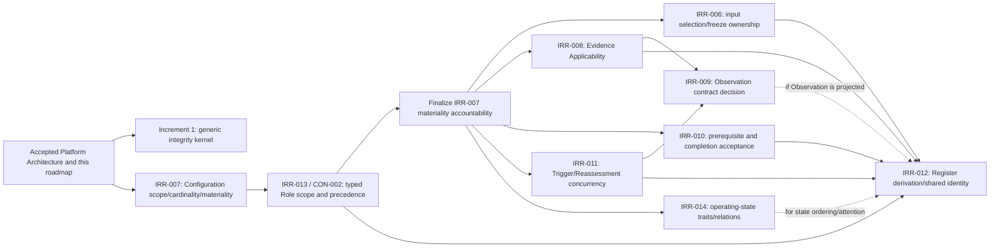

# PAIM Implementation Sequence and P1 Gates v0.1

## 1. Purpose and baseline

This artifact converts the accepted PAIM Platform Architecture v0.1 into a controlled implementation sequence. It defines when each planned increment may begin, which unresolved P1 findings are hard prerequisites, which behavior must remain unavailable until clarification, which specification owns each decision, and what evidence opens each gate.

The baseline is PAIM `main` at merge commit `836b9d6c6143e4fe315df71cf0491c3a12c94252`.

**Current-state reconciliation:** the sequencing statements below retain their historical baseline,
but the bounded v0.1 product gate is now also governed by the human-accepted release-scope decision
in `PAIM_V0_1_RELEASE_SCOPE_DECISION_IRR_009_IRR_014_v0.1.md` (merged through PR #66).
That later decision did not design IRR-009 or IRR-014. It established a separate product-gate
dimension for v0.1 and is controlling wherever this roadmap discusses Increment 9 entry or
completion.

**Release reconciliation:** Issue #69 froze the Increment 9 campaign. Issue #75 reconciled its
automated pathway oracles, F-I9-001 correction, excluded-boundary oracles, full regression,
security/access, recovery/degraded-operation, schema/migration, and static evidence onto the
accepted CPython 3.12 baseline. Human practitioner walkthroughs I9-P1, I9-P2, and I9-P3 remain
pending, so no bounded release verdict has been issued. Current evidence is recorded in
`../system/testing/PAIM_INCREMENT_9_V0_1_VALIDATION_RESULTS_v0.1.md` and
`PAIM_V0_1_RELEASE_GATE_DECISION_v0.1.md`.

Governing sources are:

- `PAIM_PLATFORM_ARCHITECTURE_v0.1.md`, especially §§20 and 23;
- `../system/testing/PAIM_CODEX_IMPLEMENTATION_READINESS_REVIEW_v0.1.md`, especially §§3, 10, and 11;
- `../system/testing/PAIM_CODEX_IMPLEMENTATION_READINESS_REREVIEW_v0.1.md`, especially §§10–12;
- `../system/specifications/PAIM_SYSTEM_RECORD_AND_DECISION_INTEGRITY_SPEC_v0.1.md`, especially §§2–12; and
- the current record-family specifications under `../system/specifications/`.

This is a sequencing and gate-control artifact only. It does not resolve any P1 question, authorize code, select a technology stack, or amend a governing specification.

### 1.1 Gate rule

An implementation increment may open only when:

1. every hard P1 prerequisite for its authorized scope is resolved in accepted governing specifications;
2. every inherited prerequisite increment has passed its acceptance gate;
3. any still-deferred P1 behavior is explicitly excluded or represented as blocked/unresolved;
4. the increment has its own bounded GitHub issue and acceptance evidence;
5. technology decisions needed for that increment have been accepted separately; and
6. the work does not silently implement a human PAIM design decision through software convenience.

No later increment opens automatically because an earlier increment merges.

### 1.2 Gate-status vocabulary

| Status | Meaning |
|---|---|
| `PLANNING ONLY` | The increment defines or accepts sequencing; it authorizes no code. |
| `P1-CLEAR / NOT AUTHORIZED` | No unresolved P1 blocks the bounded semantic scope, but a separate accepted implementation issue is still required. |
| `CLOSED — P1 GATE` | At least one named P1 must be resolved before the full increment may begin. |
| `CLOSED — UPSTREAM GATE` | Required earlier implementation increments or their accepted specifications are incomplete. |
| `CONDITIONAL SUBSCOPE ONLY` | A narrower scope may proceed if it excludes named unresolved behavior; the full increment remains closed. |
| `OPEN — SEMANTICS UNDESIGNED` | The finding's substantive design remains open and the capability must not be implemented or implied. |
| `CLOSED BY DESIGN — OUTSIDE V0.1 CLAIM` | Human design authority explicitly excluded the capability from the bounded v0.1 claim; this closes only its v0.1 product-gate applicability, subject to explicit fail-closed documentation and validation. |

## 2. Implementation increments from Platform Architecture v0.1

The roadmap preserves the ten increments in Platform Architecture §23.

| Increment | Planned outcome | Current gate status |
|---|---|---|
| 0 — architecture acceptance and P1 sequencing | Accepted roadmap, P1 hardening order, decision-record/conformance approach | `PLANNING ONLY` — completed only when this artifact is accepted; no code authorized |
| 1 — platform foundation and integrity kernel | Technology foundation plus common identity/version/history/currentness/point-in-time/audit seams | `P1-CLEAR / NOT AUTHORIZED` — no P1 semantic prerequisite; separate technology and code issues required |
| 2 — Case, Configuration, lifecycle, and Roles foundation | Case/Configuration records, lifecycle engine, Role Assignment/accountability | `CLOSED — P1 GATE` — IRR-007 and IRR-013/CON-002 |
| 3 — Evidence, Authority, and independent Value/Risk intake | Evidence/Authority/Gaps, applicability seams, separate Value/Risk freeze/history | `CLOSED — P1 GATE` — IRR-006 and IRR-008 plus Increment 2 foundations |
| 4 — Integration, Boundary, Decision, and Authorization Basis | Integration, hybrid Boundary, immutable Decision, exact authorization chain | `CLOSED — UPSTREAM GATE` — accepted Increments 1–3 and their P1 resolutions |
| 5 — Intervention and Learning | Intervention requirements/completion, target operation guard, decision-specific Learning | `CLOSED — P1 RE-REVIEW GATE` — IRR-010 design accepted and specs hardened; independent closure review plus accepted Increments 1–4 still required |
| 6 — Reassessment and Interim Operating Disposition | Trigger/Reassessment workflow, restrictive overlays, confirmation/successor, history | `CLOSED — P1 RE-REVIEW GATE` — IRR-011 design accepted and specs hardened, pending independent closure review; IRR-014 remains conditional for stronger-state automation; accepted Increments 1–5 |
| 7 — projections, Management Register, reports, and hooks | Rebuildable projections, Register, queues, reports, notification intents | `CLOSED — P1 RE-REVIEW GATE` — IRR-012 design accepted and specs hardened; independent closure review plus accepted Increments 1–6 required |
| 8 — external adapters, security hardening, and operational readiness | Selected adapters, segmentation, recovery, observability, degraded operation | `CLOSED — UPSTREAM GATE` with adapter-specific P1 conditions |
| 9 — integrated behavioral and human validation | Complete scenario, regression, longitudinal, and practitioner validation | `OPEN — HUMAN PRACTITIONER VALIDATION PENDING` — automated evidence is reconciled on CPython 3.12; I9-P1/P2/P3 remain unexecuted and no release verdict exists |

## 3. P1 dependency map

### 3.1 Dependency graph



The graph expresses semantic dependency, not implementation coupling. Dashed edges are conditional on the accepted Observation and operating-state design decisions.

### 3.2 P1 gate summary

| P1 | Earliest hard gate | May remain deferred through | Behavior that must remain blocked/unresolved |
|---|---|---|---|
| IRR-006 | Increment 3 | Increment 1 and Increment 2 | Authoritative selection/freeze/acceptance among competing Value or Risk Inputs; automatic input reuse |
| IRR-007 | Increment 2 | Increment 1 | Final Case–Configuration cardinality; multiple-current Configuration behavior; materiality/identity authority |
| IRR-008 | Increment 3 | Increment 1 and Increment 2 | Authoritative Evidence Applicability, evidence reuse/current-use selection, automated applicability checks |
| IRR-009 | Historically conditional in Increment 6/8; post-v0.1 extension gate after the accepted scope decision | Bounded v0.1, whose explicit external/manual Trigger path excludes authoritative Observation | First-class Observation persistence, Observation-to-Evidence/Trigger/Register conversion, and automated monitoring record semantics remain fail-closed |
| IRR-010 | Increment 5 | Increments 1–4 | `SPEC HARDENED — INDEPENDENT RE-REVIEW REQUIRED`: accepted design package and coordinated normative wording exist, but Increment 5 implementation remains blocked until gate re-review confirms closure |
| IRR-011 | Increment 6 | Increments 1–5 | `SPEC HARDENED — INDEPENDENT RE-REVIEW REQUIRED`: accepted Case-scoped Trigger identity, immutable many-to-many membership/Trigger Sets, grouping/duplicate/coverage determinations, bounded concurrency, no-merge rule, accountability, and completion coordination exist; implementation remains blocked pending closure review |
| IRR-012 | Increment 7 | Increments 1–6 | `SPEC HARDENED — INDEPENDENT RE-REVIEW REQUIRED`: accepted concern identity/population/currentness, immutable Candidate Set, accountable Shared Dependency equivalence, descriptive aggregation/concentration boundary, actions, history, and non-authoritative output semantics exist; implementation remains blocked pending closure review |
| IRR-013 / CON-002 | Increment 2 | Increment 1 | General Role Assignment scope resolution/precedence and permission derivation from competing assignments |
| IRR-014 | Historically conditional in Increment 6; post-v0.1 extension gate after the accepted scope decision | Bounded v0.1 exact-state and exact-scope restrictive-intersection/suspension behavior | Automated stronger/broader-state detection, state ranking, and state-derived escalation remain fail-closed |

The two deferred findings have independent current status dimensions:

| Finding | Semantic/design status | Bounded v0.1 product-gate status | Controlling traceability |
|---|---|---|---|
| IRR-009 | `OPEN — SEMANTICS UNDESIGNED` | `CLOSED BY DESIGN — OUTSIDE V0.1 CLAIM` | Accepted release-scope decision; exact manual/external provenance and Trigger promotion remain supported without Observation. |
| IRR-014 | `OPEN — SEMANTICS UNDESIGNED` | `CLOSED BY DESIGN — OUTSIDE V0.1 CLAIM` | Accepted release-scope decision; exact-state identity and exact-scope restrictive intersection/suspension remain supported without ranking. |

Neither product-gate classification is substantive closure. Every other P1 capability inside the
v0.1 claim must be substantively resolved and implemented before Increment 9 may produce a release
verdict.

## 4. Per-increment prerequisite matrix

### 4.1 Increment 0 — architecture acceptance and P1 sequencing

| Gate element | Requirement |
|---|---|
| Hard P1 prerequisites | None; this increment inventories rather than resolves P1 semantics. |
| P1 findings deferred | All nine. |
| Blocked behavior | All code-bearing work and all P1-dependent specification behavior. |
| Specification changes | None in this increment. Later bounded issues must amend the owners in §5. |
| Acceptance evidence | This artifact contains all increments, all nine P1s, dependency ordering, human decisions, gate evidence, and first-code path; independent review confirms it does not resolve P1s. |
| Gate result | Acceptance completes planning Increment 0 only. It does not open Increment 1 automatically. |

### 4.2 Increment 1 — platform foundation and integrity kernel

| Gate element | Requirement |
|---|---|
| Hard P1 prerequisites | None. Common stable/version identity, immutability, status events, dual time, current selection, explicit conflict, and point-in-time reconstruction are already P0 contracts. |
| P1 findings deferred | All nine, with no record-family workflow or P1-specific cardinality encoded. |
| Blocked behavior | Case/Configuration ownership, general Role precedence, input selection/freeze ownership, Evidence Applicability, Observation, Intervention acceptance, Reassessment concurrency, Register aggregation, and operating-state ranking. |
| Specification changes | None required for the P1-clear semantic kernel. A separate bounded technology/foundation decision is required before code. |
| Acceptance evidence before code | Accepted stack/foundation decision; bounded Increment 1 implementation contract; traceability to Integrity §§2–3, 8–10, and Platform Architecture §§6–7, 13, 18; hard-oracle test list; explicit exclusion of all P1 semantics. |
| Completion evidence | Executable proof of immutable finalized content, status-vs-content distinction, effective/recorded time, explicit absence/conflict, deterministic point-in-time selection, correction/supersession history, idempotency, and audit attribution. |

### 4.3 Increment 2 — Case, Configuration, lifecycle, and Roles foundation

| Gate element | Requirement |
|---|---|
| Hard P1 prerequisites | IRR-007 and IRR-013/CON-002, accepted as one coordinated scope/ownership hardening set or in the safe order in §6. |
| P1 findings deferred | IRR-006, IRR-008, IRR-009, IRR-010, IRR-011, IRR-012, and IRR-014. |
| Blocked behavior until clarification | Final Case–Configuration ownership/cardinality; multiple active/current Configuration scope; proposal/experimental/current dimensions; materiality/identity decision ownership; organization/business-unit/case/configuration/decision Role scopes; scope precedence and conflict; general permission derivation. |
| Specification changes | Managed Configuration, Case Lifecycle, Management Register, and Roles/Accountability specifications; coordinated consistency check against System Record/Decision Integrity and Platform Architecture. |
| Acceptance evidence | Accepted typed Case–Configuration and Role-scope model; orthogonal Configuration state dimensions; materiality/identity decision and rationale ownership; precedence/conflict examples; corrected organization-wide Role Assignment identity; lifecycle/Register conformance examples; negative tests for conflicting current Configuration and overlapping Role assignments. |
| Completion evidence | Case/Configuration history, exhaustive lifecycle/Transition Event behavior, separate state dimensions, typed Role assignments, explicit role conflicts, and no software-permission shortcut to Decision Authority. |

### 4.4 Increment 3 — Evidence, Authority, and independent Value/Risk intake

| Gate element | Requirement |
|---|---|
| Hard P1 prerequisites | IRR-006 and IRR-008; accepted Increment 2 scope and role semantics. |
| P1 findings deferred | IRR-009, IRR-010, IRR-011, IRR-012, and IRR-014. |
| Blocked behavior until clarification | Choosing/finalizing one authoritative Value or Risk Input among competitors; who may accept/freeze; rejected/withdrawn/reused input behavior; authoritative many-to-many Evidence Applicability; applicability judgment identity/history/conflict; automated evidence reuse/current-use selection. |
| Specification changes | Value/Risk Interface and Integration/Decision for IRR-006; Evidence/Authority, Managed Configuration, and Value/Risk Interface for IRR-008; Role/Case conformance references as needed. |
| Acceptance evidence | Exact selection/acceptance/freeze event and actor rules; reuse/rejection/withdrawal examples; separately preserved non-selected/dissenting inputs; versioned Evidence Applicability contract with target, assessor, rationale, scope, dual time, history, and conflict; test oracle for competing inputs and conflicting applicability. |
| Completion evidence | Separate Value/Risk lanes, exact Configuration binding, immutable freeze, explicit authoritative selection, provenance, Authority Gaps, Evidence Applicability history, and stale/conflicting evidence behavior. |

### 4.5 Increment 4 — Integration, Boundary, Decision, and Authorization Basis

| Gate element | Requirement |
|---|---|
| Hard P1 prerequisites | No new P1 beyond accepted IRR-006, IRR-007, IRR-008, and IRR-013/CON-002 inherited from Increments 2–3. |
| P1 findings deferred | IRR-009, IRR-010, IRR-011, IRR-012, and IRR-014. Operating state is an exact explicit value; no stronger/broader ranking is inferred. |
| Blocked behavior | Automated stronger-state eligibility/ranking; target-operation activation based on unresolved Intervention semantics; Observation-derived authorization; Register aggregation. |
| Specification changes | None beyond prerequisite accepted hardening unless implementation review finds a genuine new ambiguity. Governing Integration/Decision, Boundary, Authority, Roles, and Integrity contracts remain unchanged. |
| Acceptance evidence | Accepted prior increments; exact selected frozen Inputs; hybrid Boundary Snapshot/Clause examples; human/external determination records; complete Decision Authorization Basis chain; bounded-proceed cases; negative tests for invalid delegation, missing determination, broadening, and conflict. |
| Completion evidence | All-or-nothing Decision/Boundary/Authorization semantic commit, no universal score, exact history reconstruction, boundary comparison/breach behavior, and authority-negative tests. |

### 4.6 Increment 5 — Intervention and Learning

| Gate element | Requirement |
|---|---|
| Hard P1 prerequisites | IRR-010 is design-accepted and normatively hardened but remains open pending independent coordinated-spec re-review; accepted IRR-007 and IRR-013/CON-002 govern target Configuration and acceptance accountability. |
| P1 findings deferred | IRR-009, IRR-011, IRR-012, and IRR-014. |
| Blocked behavior until re-review | Increment 5 code and target-operation activation. The accepted wording defines the behavior, but implementation must not begin until independent review confirms cross-spec closure and no remaining contradiction. |
| Specification changes | Coordinated hardening in Case Lifecycle, Integration/Decision, Intervention/Learning, Roles/Accountability, Integrity, and Behavioral Validation; accepted design package `PAIM_INCREMENT_5_INTERVENTION_DESIGN_DECISION_v0.1.md`. |
| Acceptance evidence | Independent re-review of exact Obligation/Set identity, three requirement types, all-of aggregation, Completion Result vs. Acceptance, Completion Acceptor accountability/conflict, failure/fallback/reuse, Prerequisite Evaluation Basis, genuine governed Activation Authorization, lifecycle atomicity, and all 20 hard oracles. |
| Completion evidence | Intervention provenance/history, target Configuration, prerequisite guard, accepted completion, fallback/remediation, Learning-to-Evidence linkage, and no automatic Decision change from Learning. |

### 4.7 Increment 6 — Reassessment and Interim Operating Disposition

| Gate element | Requirement |
|---|---|
| Hard P1 prerequisites | IRR-011 is design-accepted and normatively hardened but remains open pending independent coordinated-spec re-review. IRR-014 is hard only for automated stronger/broader-state detection and complete state-escalation behavior. |
| P1 findings deferred | IRR-009 if the scope excludes first-class Observation; IRR-012; IRR-014 if state changes remain explicit proposals with no inferred ordering. |
| Blocked behavior until re-review | Increment 6 code; Trigger/Reassessment automation; any semantic deduplication/grouping, merge/absorption, concurrency/coverage/coordination, cancellation/supersession, or completion behavior not confirmed by independent review; stronger-state inference/ranking; Observation-to-Trigger automation if IRR-009 remains open. |
| Specification changes | Coordinated IRR-011 hardening in Reassessment, Case Lifecycle, Roles/Accountability, Integrity, Integration/Decision, Intervention/Learning, Behavioral Validation, and architecture/roadmap traceability; accepted design package `PAIM_INCREMENT_6_REASSESSMENT_DESIGN_DECISION_v0.1.md`. IRR-014 owners remain unchanged until that conditional gate opens. |
| Acceptance evidence | Independent review confirms exact Trigger identity/replay, five Determination outcomes, immutable many-to-many Trigger Sets, grouping/duplicate determinations, bounded concurrency/overlap, no v0.1 merge, cancellation/supersession, five coverage states, exact statuses, separate accountability, cross-Case source behavior, same-Decision/successor coordination, restrictive overlays, all hard oracles, and preserved IRR-009/012/014 boundaries. |
| Completion evidence | Trigger provenance, current Decision/Boundary preservation, restrictive overlay intersection/expiry, exactly one Confirmation/successor path, longitudinal history, and concurrency behavior limited to the accepted specification. |

### 4.8 Increment 7 — projections, Management Register, reports, and hooks

| Gate element | Requirement |
|---|---|
| Hard P1 prerequisites | IRR-012 is design-accepted and normatively hardened but remains open pending independent coordinated-spec re-review; accepted source semantics from IRR-006, IRR-007, IRR-008, IRR-010, IRR-011, and IRR-013/CON-002. |
| P1 findings deferred | IRR-009 only if Observation is not a Register source; IRR-014 only if Register displays exact state without ranking or state-derived prioritization. |
| Blocked behavior until re-review | Increment 7 code and any Register population, Shared Dependency grouping, Candidate Set targeting, equivalence/concentration determination, cross-Case aggregation, projection-currentness claim, or Register-context workflow not confirmed by independent review. Observation persistence and state ranking remain separately blocked. |
| Specification changes | Coordinated IRR-012 hardening in Management Register, Integrity, Roles/Accountability, Managed Configuration, Evidence/Authority, Value/Risk, Integration/Decision, Intervention/Learning, Reassessment, Behavioral Validation, Platform Architecture, and this roadmap; accepted design package `PAIM_INCREMENT_7_MANAGEMENT_REGISTER_DESIGN_DECISION_v0.1.md`. |
| Acceptance evidence | Independent review confirms exact concern key/population/categories; dual-time high-water/watermark; immutable versioned `DEPENDENCY_CANDIDATE_SET`; Shared Dependency/Equivalence/optional Concentration identity, accountability, one/absence/conflict; descriptive no-transfer aggregation; ordering/conflict/actions/history/output boundaries; all 30 hard oracles; and preserved IRR-009/014 exclusions. |
| Completion evidence | Rebuildable source-traceable Register, watermarks, explicit absence/conflict, queues/reports without hidden authority, projection inconsistency handling, and historical portfolio queries. |

### 4.9 Increment 8 — external adapters, security hardening, and operational readiness

| Gate element | Requirement |
|---|---|
| Hard P1 prerequisites | Cumulative accepted semantics for each enabled adapter: IRR-006 for Value/Risk; IRR-008 for evidence applicability/reuse; IRR-013/CON-002 for directory-to-role mapping; IRR-009 for a first-class Observation/monitoring adapter; IRR-014 for an adapter that infers state strength. |
| P1 findings deferred | Any still-open P1 whose related adapter/automation is explicitly excluded. Accepted IRR-012 applies to every portfolio export/aggregation adapter; excluding portfolio output excludes that adapter scope rather than reopening the semantic decision. |
| Blocked behavior | Adapter finalization/selection, authority inference from directories, applicability inference from documents, Observation persistence, state ranking, and portfolio aggregation not covered by accepted specifications. |
| Specification changes | No adapter-specific semantic change is made here; any missing semantic returns to the owning specification issue in §5. Technical integration contracts remain implementation artifacts created later. |
| Acceptance evidence | Adapter-by-adapter P1 applicability checklist; source provenance/idempotency/quarantine contract; no-direct-finalized-write proof; access/Decision-authority separation; recovery and degraded-operation plan; excluded capabilities stated. |
| Completion evidence | Contract tests for selected adapters, security segmentation, privileged administration, backup/restore/replay, projection rebuild, observability, and explicit integration failure. |

### 4.10 Increment 9 — integrated behavioral and human validation

| Gate element | Requirement |
|---|---|
| Hard P1 prerequisites | Every P1 capability inside the bounded v0.1 claim is substantively resolved and implemented. An accepted human-design-authority exclusion may product-gate-close a capability only when its unsupported boundary is explicit, fail-closed, documented, and directly validated. IRR-009 and IRR-014 are the only accepted v0.1 exclusions. |
| P1 findings deferred | IRR-009 and IRR-014 remain `OPEN — SEMANTICS UNDESIGNED` while each is `CLOSED BY DESIGN — OUTSIDE V0.1 CLAIM` for this product gate only. No other v0.1 P1 capability is deferred. |
| Blocked behavior | First-class Observation/telemetry automation and operating-state relation/ranking/escalation are unavailable and outside the campaign. Increment 9 must not validate or imply them. Any other in-claim behavior whose semantics or implementation is incomplete remains blocking. |
| Entry criteria | This consistency package is independently reviewed and merged; then a separate bounded Increment 9 issue freezes the exact claim, the Case-to-authorized-operation, Trigger-to-Reassessment-completion, and multi-Case Register-to-contextual-owning-domain-action pathways, both excluded-boundary hard oracles, regression/security/access/recovery/degraded/history evidence, practitioner study, usability/semantic failure separation, final traceability, and release verdict. Increment 9 is not authorized by this update. |
| Specification changes | All in-claim P1 owner artifacts must already be accepted; Behavioral Validation must contain the accepted v0.1 boundary oracles while retaining future extension scenarios as post-v0.1. |
| Acceptance evidence | Two-dimensional P1 matrix; full specification traceability; accepted frozen scenario/test plan; hard, directional, constraint, and reasoning oracles; human-study judgment boundaries; direct fail-closed proof for both exclusions. |
| Completion evidence | Versioned formal test evidence, regression/security/access/recovery/degraded/history results, failure classification, longitudinal reconstruction, practitioner validation, usability findings separated from semantic failures, final traceability, and an explicit release/gate verdict. |

**Current result:** automated evidence reconciled; human practitioner validation pending. The frozen
plan, CPython 3.12 validation results, exact validated source commit, technically closed
validation-driven finding, and two-dimensional IRR-009/014 status are retained in the Increment 9
evidence. A bounded release verdict awaits all three human walkthroughs and independent review.

## 5. P1-to-specification ownership map

This section identifies where later clarification must occur. It does not prescribe the answer.

| P1 | Primary specification owner(s) | Conforming artifacts to inspect | Required clarification output |
|---|---|---|---|
| IRR-006 | `../system/specifications/PAIM_VALUE_RISK_INTERFACE_SPEC_v0.1.md`; `../system/specifications/PAIM_INTEGRATION_AND_DECISION_SPEC_v0.1.md` | Case Lifecycle; Roles/Accountability; Integrity | Selection/acceptance/freeze event, authorized actor/mechanism, competing/non-selected inputs, reuse, rejection/withdrawal |
| IRR-007 | `../system/specifications/PAIM_MANAGED_CONFIGURATION_SPEC_v0.1.md`; `../system/specifications/PAIM_CASE_LIFECYCLE_SPEC_v0.1.md` | Management Register; Roles/Accountability; Integrity | Case–Configuration cardinality/ownership, orthogonal status dimensions, multiple-current scope, materiality/identity decision ownership |
| IRR-008 | `../system/specifications/PAIM_EVIDENCE_AND_AUTHORITY_SPEC_v0.1.md` | Managed Configuration; Value/Risk Interface; Integrity | Versioned Evidence Applicability identity, many-to-many targets, assessor/rationale/scope/dual time/history/conflict |
| IRR-009 | System Architecture plus either a new bounded Observation specification or explicit amendments to Intervention/Learning and Reassessment | Behavioral Validation; Evidence/Authority; Integrity | Human decision whether Observation is authoritative; if yes, minimum contract; if no, authoritative substitutes and conversion/linkage |
| IRR-010 | `../system/specifications/PAIM_INTERVENTION_AND_LEARNING_SPEC_v0.1.md`; `../system/specifications/PAIM_CASE_LIFECYCLE_SPEC_v0.1.md` | Integration/Decision; Roles/Accountability; Integrity; Behavioral Validation; accepted `PAIM_INCREMENT_5_INTERVENTION_DESIGN_DECISION_v0.1.md` | Hardened exact Obligation package, three types, all-of guard, Completion Result/Acceptance, Completion Acceptor, replacement/reuse, Prerequisite Evaluation Basis, genuine governed Activation Authorization, prior-operation behavior; independent closure re-review still required |
| IRR-011 | `../system/specifications/PAIM_REASSESSMENT_SPEC_v0.1.md`; `../system/specifications/PAIM_CASE_LIFECYCLE_SPEC_v0.1.md`; accepted `PAIM_INCREMENT_6_REASSESSMENT_DESIGN_DECISION_v0.1.md` | Roles/Accountability; Integrity; Integration/Decision; Intervention/Learning; Behavioral Validation; Architecture | Hardened Trigger identity/replay/determination, immutable many-to-many membership/Trigger Sets, grouping/duplicate/coverage, bounded concurrency/overlap, no merge, cancellation/supersession, status, accountability, overlays, completion coordination, cross-Case provenance, deferred IRR boundaries; independent closure re-review still required |
| IRR-012 | `../system/specifications/PAIM_MANAGEMENT_REGISTER_SPEC_v0.1.md`; accepted `PAIM_INCREMENT_7_MANAGEMENT_REGISTER_DESIGN_DECISION_v0.1.md` | Integrity; Roles/Accountability; all projected source specifications; Behavioral Validation; Architecture | Hardened exact concern identity/population/lifecycle, dual-time watermark, immutable Candidate Set, Shared Dependency Equivalence/optional Concentration determination and accountability, descriptive aggregation/no transfer, sorting/conflict/actions/history/output boundaries; independent closure re-review still required |
| IRR-013 / CON-002 | `../system/specifications/PAIM_ROLES_AND_ACCOUNTABILITY_SPEC_v0.1.md` | Managed Configuration; Case Lifecycle; Evidence/Authority; Integrity | Typed assignment target, optional Case relation, multi-scope precedence, delegation/effective-time behavior, explicit conflict |
| IRR-014 | `../system/specifications/PAIM_INTEGRATION_AND_DECISION_SPEC_v0.1.md` | Intervention/Learning; Reassessment; Management Register; Behavioral Validation | Minimum state traits, active/inactive/terminal effect, organization-configured stronger/broader relation, indeterminate comparison |

The cross-cutting Integrity specification should be amended only if a P1 clarification changes a cross-cutting invariant. It must not be duplicated merely to avoid updating the substantive owner.

## 6. Cross-P1 dependencies and ordering

### 6.1 First cluster — Configuration and Role scope

IRR-007 and IRR-013/CON-002 form a coupled foundation and must not be resolved independently in a way that creates incompatible scope models.

Safe order:

1. decide Case–Configuration ownership/cardinality and the typed Configuration/Case targets needed for scope;
2. define Role Assignment as a typed target with Case required only when the target is case-scoped;
3. define multi-scope precedence, delegation limits, effective-time selection, and explicit conflict;
4. finalize which accountable role/mechanism makes materiality and same-identity/new-identity judgments under IRR-007; and
5. run a joint conformance check across Case Lifecycle, Managed Configuration, Roles, Register, and Decision Authorization Basis.

The safest delivery is one coordinated specification-hardening issue with separate decisions inside it, or two consecutive issues that keep IRR-007's materiality authority explicitly pending until IRR-013 is accepted.

### 6.2 Second cluster — analytical selection and evidence applicability

IRR-006 depends on the first cluster because selection/freeze ownership needs valid Role scope and exact Configuration scope. IRR-008 depends on stable target identities/cardinality and benefits from the same actor/scope vocabulary.

After the first cluster, IRR-006 and IRR-008 may proceed in parallel if they share exact Configuration, actor, scope, version, and dual-time terminology. They must be jointly checked before Increment 3 because Integration readiness uses both selected frozen inputs and applicable evidence.

### 6.3 Third cluster — operation, intervention, reassessment, and state

- IRR-010's accepted/hardened semantics depend on IRR-007 for target Configuration and IRR-013 for Completion Acceptor scope/accountability; independent re-review must confirm that conformance before closure.
- IRR-011's accepted design and hardened specifications depend on accepted Case/Configuration/Decision scope so concurrency is coordinated against the right management object; independent closure re-review remains required.
- IRR-014 depends on IRR-007's separation of Configuration status/purpose from AI operating state.

IRR-010 and IRR-011 were resolved through separate bounded design, hardening, and review-gate sequences after the first cluster; IRR-011 remained pending its independent closure review at this historical checkpoint. The later accepted release-scope decision leaves IRR-014 semantically undesigned but product-gate-closes it outside the bounded v0.1 claim. It does not block exact state storage or exact-scope restrictive intersection/suspension; it remains a post-v0.1 prerequisite for any operating-state relation, ranking, or escalation automation.

### 6.4 Observation after Evidence and Trigger semantics

At this roadmap's original checkpoint, IRR-009 was to be decided after IRR-008 and IRR-011 so PAIM would not define Observation without a stable destination for Evidence Applicability or Trigger/Reassessment linkage.

Human design authority later excluded first-class Observation and automated conversion from v0.1
without choosing the post-v0.1 semantic design. IRR-009 therefore remains
`OPEN — SEMANTICS UNDESIGNED`, while its bounded v0.1 product gate is
`CLOSED BY DESIGN — OUTSIDE V0.1 CLAIM`. Exact existing-record and explicit manual/external-event
Trigger provenance is the supported v0.1 path; any future Observation family must separately define
provenance, Configuration/Boundary binding, correction/history, and conversion/linkage behavior.

### 6.5 Register last among semantic P1s

IRR-012 should be finalized after the source semantics it aggregates:

- required: IRR-006, IRR-007, IRR-008, IRR-010, IRR-011, and IRR-013/CON-002;
- conditional: IRR-009 if Observation is projected; and
- conditional: IRR-014 if Register attention or ordering depends on state strength.

Resolving Register aggregation first would risk encoding “winner,” row-unit, or shared-identity rules that contradict later authoritative records.

## 7. Human decision points

The following questions require PAIM design authority. Engineering may present options and consequences but may not select an answer through implementation.

| P1 | Human PAIM design decision left open | Engineering choices that follow only after acceptance |
|---|---|---|
| IRR-006 | Who may select, accept, and freeze each analytical lane? May one frozen version support multiple Integrations? How are competing/non-selected inputs represented? | Workflow layout, storage relationship, approval interaction, indexing |
| IRR-007 | What owns a Configuration? When may multiple active/current Configurations coexist? Who decides materiality and identity continuity? | Physical relationship mapping, edit flow, comparison UI |
| IRR-008 | Who determines applicability, to which target types, and how do competing applicability judgments coexist/resolve? | Relationship storage, search/indexing, applicability workspace |
| IRR-009 | **V0.1 PRODUCT SCOPE DECIDED; SEMANTICS OPEN:** first-class Observation/automated conversion is excluded from v0.1. Future design must still decide authoritative identity and the bridge to Evidence/Trigger. | Post-v0.1 only after separate authority: telemetry adapter, ingestion mechanism, retention/indexing |
| IRR-010 | **DECIDED, HARDENED, PENDING RE-REVIEW:** exact obligation types, all-of aggregation, Completion Acceptance accountability, and Activation Authorization are defined by the accepted design package and coordinated governing specs. | After independent closure only: task integration, guard implementation, interaction design, indexing |
| IRR-011 | **DECIDED, HARDENED, PENDING RE-REVIEW:** Case-scoped Trigger identity/replay, immutable many-to-many Trigger Sets, no-auto-grouping, bounded concurrency, explicit overlap/coverage conflict, no v0.1 merge, cancellation/supersession, status, accountability, completion coordination, and cross-Case provenance are defined by the accepted design package and coordinated governing specs. | After independent closure only: orchestration layout, physical relationship storage, indexing, locking/concurrency mechanism, and interaction design |
| IRR-012 | **DECIDED, HARDENED, PENDING RE-REVIEW:** exact concern population, immutable Candidate Set, accountable Shared Dependency equivalence, descriptive aggregation/concentration, currentness, action, and history boundaries are defined by the accepted package and coordinated specs. | After independent closure only: projection store, indexes, filters, report/export format, watermark implementation, and non-authoritative candidate-suggestion UI |
| IRR-013 / CON-002 | What scope types and precedence policy govern simultaneous assignments? How are delegation and explicit conflict handled? | Permission engine, directory mapping, scope indexes |
| IRR-014 | **V0.1 PRODUCT SCOPE DECIDED; SEMANTICS OPEN:** relation/ranking/escalation is excluded from v0.1. Future design must still define traits and organization-configured relations without assuming a universal rank. | Post-v0.1 only after separate authority: state configuration interface, relation evaluation, visualization |

For every decision, the accepted specification must state the observable result and conflict behavior. A statement that “the platform may decide” is insufficient when two choices produce materially different PAIM behavior.

## 8. Gate acceptance evidence

### 8.1 Evidence required for every P1 specification gate

Each P1 hardening issue must produce:

1. an accepted amendment or bounded new specification in the owner artifacts from §5;
2. a finding-resolution statement mapping every ambiguity and recommendation from the original review;
3. explicit record identities, scopes, cardinalities, actors/mechanisms, states, events, times, and history behavior as applicable;
4. explicit absence, conflict, indeterminate, and invalid-state behavior;
5. at least one normal, competing/concurrent, correction/supersession, and negative example;
6. behavioral invariants and test candidates sufficient to distinguish materially different implementations;
7. cross-specification conformance updates where the accepted semantics are referenced;
8. confirmation that Value/Risk independence, human judgment, exact history, authority gaps, and P0 invariants remain intact;
9. independent implementation-readiness review concluding the P1 is closed for the target increment; and
10. a clean merged-main checkpoint before the dependent implementation issue opens.

### 8.2 Evidence required for every implementation gate

Each code-bearing increment must have:

- an accepted bounded implementation contract and explicit exclusions;
- accepted technology decisions only for that increment;
- traceability from governing specification → architecture module → implementation behavior → test oracle;
- hard-prerequisite P1 closure evidence;
- inherited increment acceptance evidence;
- negative tests for each blocked/permissive fallback risk;
- point-in-time/history tests where authoritative records are involved;
- proof that deferred P1 behavior remains unavailable or explicitly unresolved;
- no unrelated follow-on functionality; and
- independent PR review before merge.

### 8.3 Gate-control record

Every implementation issue should include a compact gate record:

| Field | Required content |
|---|---|
| Increment | Platform Architecture §23 increment number and bounded subincrement |
| Governing commit | Exact clean-main starting SHA |
| Hard P1 prerequisites | Finding IDs and accepted specification commit/PR |
| Deferred P1s | Finding IDs and blocked/unresolved behavior |
| Inherited implementation gates | Accepted prior increment evidence |
| Scope | Exact modules and observable behavior included |
| Exclusions | APIs/UI/integrations/workflows not authorized |
| Acceptance oracles | Hard/directional/constraint/reasoning tests |
| Stop condition | Draft PR and no automatic follow-on |

## 9. Recommended path to first implementation

The smallest safe path to the first code-bearing increment does **not** require resolving a P1 first. Increment 1 is intentionally limited to already-accepted cross-cutting P0 integrity semantics and must not encode any record-family P1 decision.

Recommended path:

### Step 1 — accept this roadmap

Merge this artifact after independent review and return to clean `main`. This completes sequencing only.

### Step 2 — create one bounded technology/foundation decision issue

Produce an accepted implementation decision artifact for Increment 1 only. It should select the minimum language/runtime, persistence approach, test framework, repository/module layout, and local execution boundary needed for the integrity kernel. It must demonstrate how the selected mechanisms preserve:

- immutable versions and append-preserving history;
- recorded/effective time and point-in-time reads;
- deterministic current selection and explicit conflict;
- idempotent semantic writes;
- audit attribution; and
- replacement/extension without encoding P1 domain semantics.

This decision issue remains design-only and must not bootstrap application code.

### Step 3 — create the first code-bearing issue as Increment 1A

Bound the first implementation to a minimal vertical foundation:

- repository/runtime bootstrap authorized by Step 2;
- common Record ID and immutable Record Version behavior;
- draft/finalization boundary;
- status events distinct from content versions;
- recorded/effective time;
- pure current-selection outcome of one version, explicit absence, or explicit conflict;
- correction/supersession/withdrawal history links;
- point-in-time query seam;
- principal versus PAIM actor attribution seam; and
- executable hard-oracle tests for those behaviors.

Explicitly exclude Case, Configuration, Roles, Evidence, Value/Risk, Integration, Boundary, Decision, Intervention, Reassessment, Register, external adapters, UI, and all P1-specific behavior.

### Step 4 — require Increment 1A acceptance before any domain module

The first code-bearing PR must prove the common kernel can preserve exact history and deterministic selection without inventing family semantics. Only after it merges and returns to clean `main` may a later Increment 1B or the first P1 hardening issue be selected.

This path is smaller and safer than resolving all P1s before any code, because the common integrity kernel is already an accepted contract and is a dependency of every later domain increment. It is safer than beginning Case/Configuration scaffolding, because even placeholder cardinalities or Role scopes could silently decide IRR-007 or IRR-013.

## 10. Deferred P1 plan

### 10.1 Before Increment 2

Resolve the coordinated foundation cluster:

1. IRR-007 Case–Configuration/cardinality/status/materiality scope decision;
2. IRR-013/CON-002 typed Role Assignment scope and precedence; and
3. IRR-007 materiality/identity accountability finalized against the accepted Role model.

### 10.2 Before Increment 3

Resolve, potentially in parallel after the foundation cluster:

- IRR-006 Value/Risk selection, acceptance, freeze, reuse, and competing inputs; and
- IRR-008 versioned Evidence Applicability.

### 10.3 Before Increment 5

IRR-010 design authority is accepted in `PAIM_INCREMENT_5_INTERVENTION_DESIGN_DECISION_v0.1.md`. Coordinated governing hardening defines Intervention requirement classification, all-of aggregate completion, Completion Result/evidence, Completion Acceptance accountability, replacement/reuse, Prerequisite Evaluation Basis, and Activation Authorization.

The gate is not closed merely because wording is present. Before Increment 5 code, an independent focused re-review must confirm the hardened Intervention/Learning, Case Lifecycle, Integration/Decision, Roles/Accountability, Integrity, and Behavioral Validation artifacts are cross-consistent and make all 20 accepted hard oracles deterministic. Until that review accepts closure, Increment 5 remains blocked.

### 10.4 Before full Increment 6

IRR-011 design authority is accepted in `PAIM_INCREMENT_6_REASSESSMENT_DESIGN_DECISION_v0.1.md`. Coordinated governing hardening defines Case-scoped Trigger identity/replay/determination, immutable many-to-many Trigger Sets, accountable grouping and duplicate disposition, bounded concurrency/overlap, no v0.1 merge, cancellation/supersession, no-lost-trigger coverage, exact statuses, separate accountability functions, same-Decision/successor coordination, cross-Case source provenance, restrictive overlays, and dual-time history.

The gate is not closed merely because wording is present. Before Increment 6 code, an independent focused re-review must confirm that the hardened Reassessment, Case Lifecycle, Roles/Accountability, Integrity, Integration/Decision, Intervention/Learning, Behavioral Validation, Platform Architecture, and roadmap artifacts are cross-consistent and make the accepted hard oracles deterministic. Until that review accepts closure, Increment 6 remains blocked.

At the Increment 6 checkpoint, IRR-009 remained deferred and IRR-014 remained conditional. The
later accepted v0.1 decision preserves that substantive deferral while establishing that neither
blocks the bounded product gate: exact existing/manual/external Trigger provenance and exact-state,
exact-scope restrictive intersection/suspension are supported; Observation automation and
state-relation/ranking/escalation remain unavailable.

### 10.5 Before Observation automation

IRR-009 is a post-v0.1 extension gate. Before first-class Observation or automatic conversion is
enabled, a separate human-accepted design, coordinated specification hardening, implementation, and
validation package must close its substantive semantics. Until then, operation signals may enter
only through explicitly supported Evidence or exact manual/external Trigger paths; proposed intake
is non-authoritative until an owning-domain command succeeds, and no Observation is persisted or
inferred. A future extension must not reinterpret v0.1 historical records.

### 10.6 Before Increment 7

IRR-012 design authority is accepted in `PAIM_INCREMENT_7_MANAGEMENT_REGISTER_DESIGN_DECISION_v0.1.md`. Coordinated governing hardening defines exact concern identity/population/categories, dual-time currentness and staleness, immutable Dependency Candidate Sets, accountable Shared Dependency Equivalence and optional Concentration Determinations, descriptive cross-Case aggregation without transfer, conflict/ordering/action boundaries, exact historical manifests, and non-authoritative reports/queues/notifications.

Before Increment 7 code, an independent focused re-review must confirm cross-spec consistency and deterministic hard oracles. IRR-009 Observation behavior and IRR-014 operating-state ranking remain excluded; their absence does not permit telemetry population or state-derived priority.

### 10.7 Before Increment 9 completion

All P1 capabilities inside the bounded v0.1 claim must be substantively resolved and implemented.
IRR-009 and IRR-014 are the only accepted exceptions: each remains
`OPEN — SEMANTICS UNDESIGNED` and is `CLOSED BY DESIGN — OUTSIDE V0.1 CLAIM` for the bounded v0.1
product gate only. Their unsupported behavior must remain explicit, fail-closed, documented, and
directly validated; Increment 9 must not validate or imply either excluded semantic family.

Increment 9 may begin only after this consistency package is independently reviewed and merged and
a separate bounded issue freezes the exact v0.1 claim, the Case-to-authorized-operation,
Trigger-to-Reassessment-completion, and multi-Case
Register-to-contextual-owning-domain-action pathways, hard oracles including both exclusions,
regression/security/access/recovery/degraded/history evidence,
practitioner study and usability/semantic-failure separation, final traceability, and the release
verdict. Scope completion does not authorize Increment 9 and does not mean validation or release is
complete.

**Current reconciliation:** Issue #69 authorized the campaign and Issue #75 re-established all
automated evidence on CPython 3.12. The human-study completion condition remains unsatisfied, so
PAIM v0.1 remains below 100% and unreleased. IRR-009 and IRR-014 remain semantically open; their
excluded capabilities remain fail-closed and were not validated as positive semantics.

## 11. Final sequencing recommendation

Accept this roadmap as the control artifact for implementation gating.

The next safe work after acceptance is **not** a broad platform build and **not** automatic P1 resolution. It is one bounded, design-only technology/foundation decision for Increment 1, followed—only if separately authorized—by a minimal code-bearing Increment 1A implementing the common integrity kernel and its hard-oracle tests.

The governing sequence is:

```text
accept roadmap
→ decide minimum Increment 1 technology/foundation
→ implement and validate common integrity kernel
→ resolve IRR-007 + IRR-013/CON-002 foundation cluster
→ open Case/Configuration/lifecycle/Role implementation
→ resolve remaining P1s immediately before the increments that depend on them
→ accept bounded v0.1 exclusions for IRR-009/014 while preserving their semantic-open status
→ merge this consistency reconciliation
→ separately authorize and freeze Increment 9 integrated/human validation
```

At every gate, unresolved behavior remains blocked or explicitly unresolved. No newest, broadest, most permissive, or implementation-convenient default may stand in for an accepted PAIM semantic decision.
