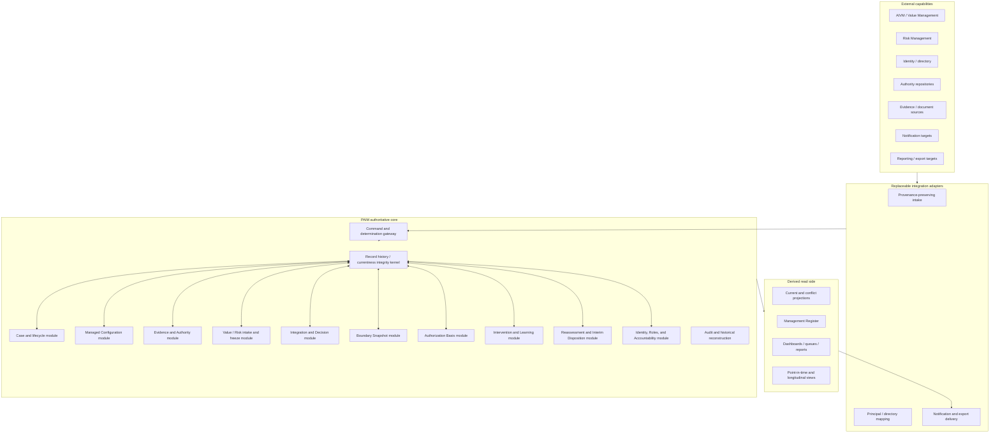

# PAIM Platform Architecture v0.1

## Status

First implementation-oriented, technology-independent platform architecture for Practical AI Management (PAIM).

This architecture is governed by the current PAIM system architecture and specifications at the Issue #7 starting checkpoint. It defines software responsibilities, logical boundaries, consistency behavior, read/write semantics, extension points, and test seams. It does not select a programming language, framework, database, message system, identity provider, cloud, deployment topology, or user-interface technology.

The implementation-readiness gate is:

> **READY FOR PLATFORM ARCHITECTURE WITH NON-BLOCKING P1 CLARIFICATIONS REMAINING**

Source: `../system/testing/PAIM_CODEX_IMPLEMENTATION_READINESS_REREVIEW_v0.1.md`, §§11–12.

## 1. Purpose and scope

The PAIM platform must make the accepted PAIM management semantics durable, inspectable, enforceable, and testable without replacing accountable judgment.

This architecture defines:

- the logical platform modules and their ownership;
- the authoritative write and history model;
- lifecycle, boundary, authorization, and reassessment enforcement;
- current and point-in-time query behavior;
- derived projections, including the Management Register;
- security and external-integration boundaries;
- explicit failure/conflict behavior;
- test seams and deployment/scaling boundaries;
- the unresolved P1 dependency register; and
- a bounded sequence for later implementation.

This architecture does not define physical schemas, endpoint contracts, user-interface layouts, infrastructure resources, migrations, or application code.

## 2. Governing contract hierarchy

Platform behavior must be derived in this order:

1. `../system/architecture/PAIM_SYSTEM_ARCHITECTURE_v0.1.md` defines the complete-system purpose and architectural principles.
2. `../system/specifications/PAIM_SYSTEM_RECORD_AND_DECISION_INTEGRITY_SPEC_v0.1.md` controls cross-cutting authoritative-record, Boundary Snapshot, lifecycle-transition, Decision Authorization Basis, and Interim Operating Disposition semantics.
3. The remaining specifications under `../system/specifications/` control the substantive meaning, content, roles, and human judgments of their record families.
4. `../system/testing/PAIM_SYSTEM_BEHAVIORAL_VALIDATION_STRATEGY_v0.1.md` defines behavioral invariants and oracle types.
5. `../system/testing/PAIM_CODEX_IMPLEMENTATION_READINESS_REREVIEW_v0.1.md` records the current platform-architecture gate and non-blocking P1 dependencies.

Where a platform design choice would change observable PAIM behavior, the specifications control. Where the specifications deliberately defer a software mechanism, this architecture defines a replaceable boundary and does not elevate the mechanism into PAIM semantics.

### 2.1 Specification-to-module ownership

| Governing specification | Primary platform ownership |
|---|---|
| `../system/specifications/PAIM_CASE_LIFECYCLE_SPEC_v0.1.md` | Case/Lifecycle module and lifecycle test seam |
| `../system/specifications/PAIM_MANAGED_CONFIGURATION_SPEC_v0.1.md` | Managed Configuration module |
| `../system/specifications/PAIM_EVIDENCE_AND_AUTHORITY_SPEC_v0.1.md` | Evidence and Authority module; Authorization Basis inputs |
| `../system/specifications/PAIM_VALUE_RISK_INTERFACE_SPEC_v0.1.md` | Separate Value and Risk intake/freeze lanes |
| `../system/specifications/PAIM_INTEGRATION_AND_DECISION_SPEC_v0.1.md` | Integration and Decision module; Boundary and Authorization collaboration |
| `../system/specifications/PAIM_INTERVENTION_AND_LEARNING_SPEC_v0.1.md` | Intervention and Learning module |
| `../system/specifications/PAIM_REASSESSMENT_SPEC_v0.1.md` | Reassessment and Interim Operating Disposition module |
| `../system/specifications/PAIM_MANAGEMENT_REGISTER_SPEC_v0.1.md` | Derived Management Register/projection module |
| `../system/specifications/PAIM_ROLES_AND_ACCOUNTABILITY_SPEC_v0.1.md` | Identity, Roles, and Accountability module; security/authority separation |
| `../system/specifications/PAIM_SYSTEM_RECORD_AND_DECISION_INTEGRITY_SPEC_v0.1.md` | Shared integrity kernel plus Boundary, lifecycle, Authorization Basis, and reassessment invariants |

Cross-module behavior remains jointly traceable to every participating specification; the table assigns implementation ownership, not exclusive semantic authority.

## 3. Architectural goals and constraints

### 3.1 Goals

The platform architecture must:

1. preserve Value and Risk as separately attributable, independently refreshable analytical inputs;
2. preserve accountable human and established-authority judgment rather than infer a universal answer;
3. make every authoritative version, status event, transition, authorization, determination, and relationship exactly reconstructable;
4. select current records deterministically for explicit scope, purpose, effective time, and optional knowledge cutoff;
5. represent absence, uncertainty, authority gaps, indeterminacy, and incompatible current records explicitly;
6. enforce the canonical Case lifecycle and its mandatory guards;
7. support hybrid structured/narrative Integrated Operating Boundaries;
8. validate exact Decision authority scope and time without equating software permission with management authority;
9. preserve the current Decision and Boundary while intervention or reassessment is in progress;
10. expose derived management views without creating a competing source of truth;
11. provide stable seams for specification-level, integrated, longitudinal, negative, metamorphic, invariance, and human-interface testing; and
12. remain deployable as one bounded system while retaining separable module and integration boundaries.

### 3.2 Non-negotiable constraints

- No finalized, frozen, authorized, issued, or decision-relied-upon content is edited in place.
- No last-write-wins, newest-record, widest-scope, most-permissive, or row-order fallback determines authoritative current state.
- No platform role, administrator privilege, external directory group, or approval click creates organizational decision authority by itself.
- No missing human or external determination is interpreted as satisfaction.
- No derived projection, dashboard, report, notification, or export becomes an authoritative PAIM record merely because it is operationally convenient.
- No combined score replaces Value, Risk, boundary, uncertainty, authority, rationale, or management judgment.
- No external integration writes directly into finalized authoritative state.
- No unresolved P1 question is silently resolved by schema shape, workflow defaults, or user-interface behavior.

These constraints implement `PAIM_SYSTEM_ARCHITECTURE_v0.1.md`, §§3 and 20, and `PAIM_SYSTEM_RECORD_AND_DECISION_INTEGRITY_SPEC_v0.1.md`, §§2–3, 8, and 10.

## 4. Architectural style

PAIM uses a **modular authoritative core with replaceable adapters and derived projections**.

Logical module boundaries are mandatory. Physical process boundaries are not. An implementation may initially deploy the modules together and later separate selected workloads if it preserves the same consistency, history, authority, and query semantics.



The arrows express logical dependency and information flow, not network calls or deployment units.

## 5. Logical component model

### 5.1 Command and determination gateway

The gateway is the single logical entry point for proposed authoritative change. It:

- authenticates the technical principal through the security boundary;
- resolves the claimed PAIM actor and role context without assuming authority;
- records request provenance and idempotency context;
- requires explicit target IDs/versions, scope, effective time, and expected-current preconditions;
- routes the command to the owning module;
- invokes cross-cutting integrity, lifecycle, boundary, and authorization checks;
- requires human/external determination records where substantive judgment is needed; and
- returns an accepted authoritative write set or an explicit rejection/conflict result.

The gateway is not a universal business-rule engine. Substantive rules remain owned by the modules and governing specifications.

### 5.2 Record history and currentness integrity kernel

The integrity kernel implements the common contract in `PAIM_SYSTEM_RECORD_AND_DECISION_INTEGRITY_SPEC_v0.1.md`, §§2–3. It owns logical behavior for:

- stable Record IDs and immutable Record Version IDs;
- draft eligibility and finalization;
- status-event history;
- recorded/effective time;
- correction, amendment, supersession, and withdrawal links;
- exact-version relationships;
- scope-aware current selection;
- explicit absence and incompatible-current conflict;
- point-in-time reconstruction; and
- invariant evaluation shared across record families.

Every authoritative module uses this kernel. A module may add stricter family-specific rules but may not weaken the common history/currentness behavior.

### 5.3 Case and lifecycle module

This module owns:

- Case identity and authoritative versions;
- the single current Case lifecycle state;
- immutable Lifecycle Transition Events;
- the canonical allowed-transition table;
- transition guards and allowed skip behavior;
- closure, reopening, and supersession behavior;
- trigger relationships to Case movement; and
- visibility of current operation while lifecycle work continues.

It does not own AI operating state, Configuration status, Intervention status, Reassessment status, or Interim Operating Disposition status. It reads those exact versions only to evaluate guards. Its behavior is governed by `PAIM_SYSTEM_RECORD_AND_DECISION_INTEGRITY_SPEC_v0.1.md`, §5, and `PAIM_CASE_LIFECYCLE_SPEC_v0.1.md`, §§3–16.

### 5.4 Managed Configuration module

This module owns:

- stable Configuration identity and immutable Configuration versions;
- the bounded configuration snapshot and explicit exclusions;
- Configuration status and purpose dimensions;
- predecessor/successor relationships and configuration comparison;
- material-change determinations recorded by accountable actors;
- links from evidence, inputs, decisions, interventions, and reassessments; and
- conflicts or gaps in current Configuration selection.

It must not equate Configuration status with lifecycle state or AI operating state. It must create a new immutable version for every substantive finalized configuration-content change even when the change is judged non-material to one Decision (`PAIM_MANAGED_CONFIGURATION_SPEC_v0.1.md`, §§2–7 and 18–22).

### 5.5 Evidence and Authority module

This module owns distinct but related families for:

- Evidence, provenance, classification, maturity, scope, limitations, and version history;
- Authority Records, source, scope, decision rights, conditions, status, and effective period;
- Authority Gaps, including `DECISION AUTHORITY UNRESOLVED`;
- authority conflict and applicability determinations;
- Evidence Applicability extension points; and
- evidence/authority relationships to findings, controls, decisions, uncertainty, and reassessment.

Evidence never becomes authority merely because it is documentary. Authority never becomes a Decision authorization merely because it contains a permission or right. Decision authorization is established only through the Authorization Basis module.

### 5.6 Value and Risk intake/freeze module

The module contains two analytically separate lanes sharing only the common five-part interface and integrity services:

- Value: Finding, Boundary, Uncertainty, Implication, Provenance;
- Risk: Finding, Boundary, Uncertainty, Implication, Provenance.

It owns intake, configuration binding, draft review, freeze/finalization, refresh-required status, correction, and supersession. Frozen content remains verbatim and immutable. Integration may relate and interpret the two inputs but cannot overwrite either.

The architecture permits separate external sources, review paths, and permissions for Value and Risk. It prohibits a combined ingestion mapping that loses source attribution or rewrites one implication into the other's vocabulary. Governing sources are `PAIM_VALUE_RISK_INTERFACE_SPEC_v0.1.md`, §§3–18, and `PAIM_SYSTEM_RECORD_AND_DECISION_INTEGRITY_SPEC_v0.1.md`, §§3 and 8.19.

### 5.7 Integration and Decision module

This module owns:

- Integration identity, selected exact frozen inputs, exact Configuration, constraints, uncertainty, alternatives, and interaction analysis;
- proposed management judgment and rationale;
- Management Decision identity and immutable versions;
- selected AI operating state;
- links to the Boundary Snapshot and Decision Authorization Basis;
- conditions, intervention, learning, and reassessment relationships; and
- Decision correction, amendment, withdrawal, expiry, and supersession behavior.

An Integration may complete before Decision authority is resolved. A Case may become `DECIDED` only after the Boundary Snapshot is finalized and the exact Decision is authorized through a valid Authorization Basis. The module never computes a universal Value/Risk score (`PAIM_INTEGRATION_AND_DECISION_SPEC_v0.1.md`, §§5–26 and 33–35).

### 5.8 Integrated Operating Boundary module

This module owns separately identifiable, immutable Boundary Snapshots and material clauses. It provides:

- exact Case, Configuration, and Integration version binding;
- structured and narrative clauses with stable Clause IDs;
- clause effect, target, provenance, and verification mode;
- structured values/operators/units where mechanical testing is expected;
- recorded human and external determinations;
- clause-by-clause comparison;
- breach and indeterminate outcomes; and
- successor Snapshot relationships.

It does not authorize operation. It supplies boundary integrity results to Decision authorization, operation, intervention, reassessment, queries, and tests.

### 5.9 Decision Authorization Basis module

This module owns the one logical Authorization Basis for each authorized Decision version. It validates and preserves:

- exact Decision and Boundary Snapshot;
- Decision Authority identity;
- exact Role Assignment, delegation chain, committee, or other legitimate mechanism;
- supporting Authority Record or explicit organizational mechanism;
- scope, limits, effective period, and configuration/operating-state coverage;
- the authorization event and any required conditions, dissent, or exceptions;
- Authority Gaps considered and bounded-proceed determinations; and
- historical correction/supersession relationships.

Technical approval/signature mechanisms are adapters to this module. A successful signature proves that a principal performed an approval action; it does not establish that the principal held valid PAIM Decision Authority. Validity requires the full chain in `PAIM_SYSTEM_RECORD_AND_DECISION_INTEGRITY_SPEC_v0.1.md`, §6.

### 5.10 Intervention and Learning module

This module keeps Intervention and Learning distinct from each other and from the Decision.

Intervention responsibilities include exact Decision/Configuration binding, target Configuration, provenance category, owner, required changes, controls, dependencies, completion criteria, fallback, remediation, status, evidence, and operational consequences.

Learning responsibilities include the Decision/uncertainty question, evidence to generate, method provenance, owner, completion condition, result, limitations, generated Evidence links, and reassessment handoff.

Blocked, failed, cancelled, partial, inconclusive, and overdue states remain visible and do not silently satisfy Decision conditions or resolve uncertainty (`PAIM_INTERVENTION_AND_LEARNING_SPEC_v0.1.md`, §§2–37).

### 5.11 Reassessment and Interim Operating Disposition module

This module owns:

- Reassessment Trigger intake and materiality determination records;
- Reassessment identity, status, scope, review history, and exact current context;
- Interim Operating Disposition versions and restrictive overlays;
- Decision Confirmation records;
- links to successor/amendment Decisions;
- disposition conflict, expiry, withdrawal, and completion; and
- the longitudinal chain from the prior Decision to the resulting outcome.

Opening reassessment never changes operation by itself. Current operation remains governed by the exact current Decision and Boundary plus every applicable authorized restrictive Interim Operating Disposition.

### 5.12 Management Register and projection module

This module builds non-authoritative, reproducible projections for:

- current management position by Case/Configuration;
- lifecycle, operating, Configuration, Intervention, Learning, and Reassessment states without collapsing them;
- boundary summaries and breaches;
- Value and Risk positions;
- Authority Gaps and authorization conflicts;
- uncertainty and management-attention conditions;
- provider/model, control, and capacity dependencies;
- active, historical, queue, dashboard, report, and export views.

Every projected fact retains its selected source Record Version ID, query scope, effective time, knowledge cutoff, and projection watermark. Absence and conflict are projected rather than repaired. The Register never accepts substantive edits (`PAIM_MANAGEMENT_REGISTER_SPEC_v0.1.md`, §§3–26 and 33–37).

### 5.13 Identity, Roles, and Accountability module

This module owns mappings among:

- authenticated technical principals;
- PAIM actor identities;
- Role Assignment and delegation versions;
- assignment scope and effective period;
- role combinations/conflicts and exceptions;
- record accountability; and
- orphaned-obligation and unavailable-owner conditions.

It does not grant Decision authority merely by assigning a software role. Decision authority becomes effective for a Decision only when the Authorization Basis module validates the exact chain. The module preserves the separation between analysis, decision, implementation, review, and system administration (`PAIM_ROLES_AND_ACCOUNTABILITY_SPEC_v0.1.md`, §§2–28 and 35–39).

### 5.14 Audit and historical reconstruction module

This module exposes immutable, attributable history across all authoritative modules. It supports:

- record/version and status-event timelines;
- effective-time and recorded-knowledge views;
- exact Decision reconstruction;
- authorization explanation;
- lifecycle Transition Event inspection;
- Boundary clause and determination history;
- correction/supersession/withdrawal chains;
- longitudinal Case and Reassessment chains; and
- exportable audit evidence with source-version references.

Audit is not a second copy of business truth. It is a faithful read capability over authoritative records and integrity events.

### 5.15 Notification and escalation hooks

The platform emits durable post-commit delivery intents for events requiring attention, such as:

- current-record conflicts;
- unresolved or changed authority;
- illegal-transition attempts;
- boundary breach or indeterminate determination;
- blocked/failed Intervention;
- overdue Learning or Reassessment;
- Interim Operating Disposition expiry;
- missing owner or orphaned obligation; and
- projection inconsistency.

Notification delivery is replaceable and may fail independently. Delivery failure never rolls back an accepted authoritative management event or hide the underlying attention condition. Escalation destinations, service levels, and channels remain organization-specific.

## 6. Authoritative write architecture

### 6.1 Logical command context

Every proposed authoritative change carries, as applicable:

- authenticated principal and resolved PAIM actor;
- claimed Role Assignment/delegation versions;
- command type and target Record ID/version;
- expected-current version or expected absence;
- Case, Configuration, scope, and purpose;
- proposed effective time and recorded-time source;
- exact input/dependency versions;
- determination, rationale, and provenance references;
- authorization/approval evidence where required; and
- idempotency/correlation identity.

This is a logical consistency contract, not an API or physical schema.

### 6.2 Processing phases

An authoritative command passes through:

1. **Technical access check** — may this principal attempt this action on this resource?
2. **Context resolution** — are target identities, versions, scope, time, and dependencies explicit and retrievable?
3. **Currentness/precondition check** — do expected versions still govern, or has concurrent change created a conflict?
4. **Family invariant check** — does the owning module accept the proposed record behavior?
5. **Cross-cutting integrity check** — do history, lifecycle, boundary, authorization, and reassessment invariants hold?
6. **Human/external determination check** — is every required accountable determination present and attributable?
7. **Semantic commit** — persist the complete accepted authoritative write set all-or-nothing from the user's observable perspective.
8. **Projection and delivery publication** — make committed change available to projections, audit, notifications, and exports with replay/retry support.

A failure in phases 1–6 creates no partial authoritative change. Phase 8 may be asynchronous, but lag and failure must remain observable.

### 6.3 Semantic commit bundles

Some operations require multiple authoritative facts to become visible together:

| Operation | Minimum all-or-nothing semantic write set |
|---|---|
| Finalize a record version | Finalized immutable version, finalization actor/basis/time, and required exact-version links |
| Change Case lifecycle state | Lifecycle Transition Event and the new derived current lifecycle state |
| Authorize a Decision | Immutable Decision version, finalized referenced Boundary Snapshot, complete Decision Authorization Basis, authorization event, current/supersession effects, and `DECIDED` transition when applicable |
| Apply Interim Operating Disposition | Authorized disposition version, exact Decision/Boundary/configuration links, effective/expiry terms, and current restrictive-overlay result |
| Complete Reassessment unchanged | Completed Reassessment version, immutable Decision Confirmation, disposition end/supersession effects, and allowed lifecycle transition |
| Complete Reassessment with change | Completed Reassessment version, authorized successor/amendment Decision and its Boundary/Authorization Basis, predecessor/supersession links, disposition end effects, and allowed lifecycle transition |
| Correct authoritative content | New correction/version, link to corrected version, affected-record references, and reassessment/attention condition where material |

Physical transaction mechanics are deferred. The observable result may never expose an authorized Decision without its exact Boundary and Authorization Basis, or a completed Reassessment without exactly one allowed outcome.

### 6.4 Concurrency and idempotency

- Commands that depend on current state include expected-version/current-selection preconditions.
- A stale precondition rejects or surfaces conflict; it is never silently rebased onto newer content.
- Repeated delivery of the same idempotency identity returns the original outcome or an explicit payload mismatch, not a duplicate authoritative record.
- Simultaneous compatible records are permitted only in explicitly distinguishable scopes.
- Simultaneous incompatible records create the governing conflict state and require accountable resolution.
- Projection lag never authorizes a write; authoritative preconditions are evaluated against authoritative state.

## 7. Authoritative record and history semantics

### 7.1 Logical authoritative record envelope

Every authoritative record family supports the common concepts below, with family-specific content added by its governing specification:

- stable Record ID;
- immutable Record Version ID;
- record family/type;
- lifecycle/finalization status;
- creator/source and provenance;
- recorded time;
- effective time or half-open interval;
- predecessor and relationship type;
- correction/amendment/supersession/withdrawal reason;
- exact versions relied upon; and
- status-event history.

This is a logical envelope, not a relational, document, or event-store schema.

### 7.2 Draft and finalization boundary

Drafts may be edited only while they have not been finalized, frozen, issued, authorized, made effective, or relied upon by a finalized record. Draft audit depth is a platform choice, but cited content must remain reconstructable.

Finalization creates immutable substantive content. Later lifecycle facts are status events unless content, scope, rationale, boundary, condition, conclusion, requirement, authority basis, or accountable judgment changes, in which case a new version is required.

### 7.3 Dual-time model

Every finalized version and status event preserves:

- **effective time** — when it governs the management subject; and
- **recorded time** — when PAIM learned/recorded it.

The query model supports both `effective_at` and optional `known_at`. Backdated facts never rewrite what was known at an earlier recorded cutoff. Open-ended intervals remain effective until a valid ending event or successor for the same scope.

### 7.4 Current selection

Current selection is a pure, testable semantic function of:

```text
record family
+ management subject and scope
+ configuration/version where applicable
+ decision/workflow purpose where applicable
+ effective_at
+ optional known_at
+ family-specific eligibility guards
```

The output is exactly one of:

- one eligible authoritative Record Version;
- explicit absence/not established; or
- explicit incompatible-current conflict with all candidates and reasons.

No projection or module may substitute another selection rule.

### 7.5 Correction, amendment, supersession, and withdrawal

- **Correction** preserves the erroneous version and records corrected content and affected records.
- **Amendment** creates a prospectively effective version of the same management subject. A Decision amendment is an authorized successor Decision.
- **Supersession** links predecessor and successor for a declared scope/effective time without invalidating historical truth.
- **Withdrawal** ends prospective reliance and may create an integrity condition/reassessment trigger without rewriting history.

### 7.6 Authoritative versus derived information

Authoritative records are finalized records governed by the common contract and their family specification. Derived information includes current projections, Register entries, dashboards, queues, reports, attention indicators, notifications, indexes, and caches.

Every derived fact must be traceable to:

- exact source Record Version IDs;
- effective and knowledge time;
- projection rule/version;
- projection watermark; and
- absence/conflict/indeterminate state where applicable.

Derived information may be rebuilt. Authoritative history may not be reconstructed from a derived view if source detail has been lost.

### 7.7 Point-in-time reconstruction

The platform must reconstruct:

- state effective at a requested time using all knowledge now available;
- state the platform knew at a requested recorded-time cutoff; and
- the exact basis used by a historical Decision regardless of later corrections or supersession.

Decision reconstruction includes Configuration, frozen Value/Risk Inputs, material Evidence and applicability, Authority Records/Gaps, Boundary Snapshot and clause determinations, Authorization Basis, Role Assignments/delegations, uncertainty, rationale, alternatives, Interventions, Learning, and predecessor/successor relationships as required by `PAIM_SYSTEM_RECORD_AND_DECISION_INTEGRITY_SPEC_v0.1.md`, §3.12.

## 8. Lifecycle and state-machine architecture

### 8.1 Separate state dimensions

The platform represents at least these independent dimensions:

| Dimension | Owner | Example |
|---|---|---|
| Case lifecycle state | Case/Lifecycle module | `READY_FOR_INTEGRATION`, `REOPENED` |
| AI operating state | authorized Decision | bounded continuation, suspended |
| Configuration status/purpose | Managed Configuration module | current, proposed, experimental |
| Decision status | Integration/Decision module | proposed, authorized/current, superseded |
| Intervention status | Intervention/Learning module | blocked, partially completed |
| Learning status | Intervention/Learning module | active, inconclusive |
| Reassessment status | Reassessment module | opened, completed |
| Interim Disposition status | Reassessment module | current, expired, withdrawn |
| Authority/Gap status | Evidence/Authority module | established, unresolved, expired |

No generic traffic-light or workflow status replaces these dimensions.

### 8.2 Transition enforcement

The lifecycle module treats `PAIM_SYSTEM_RECORD_AND_DECISION_INTEGRITY_SPEC_v0.1.md`, §5.3 as the executable semantic transition table:

- an unlisted source/target pair is illegal;
- each transition requires an immutable Transition Event;
- every guard uses exact authoritative versions;
- required human judgments are recorded rather than inferred;
- compressed UI flows still execute each required transition and guard;
- `SUPERSEDED` is terminal; and
- reopening creates a new transition/Reassessment chain without editing closure history.

### 8.3 Guard evaluation

Guard results identify:

- rule/specification reference;
- exact inputs evaluated;
- mechanical result;
- required human/external determination and its record, if any;
- missing/conflicting information; and
- pass, fail, or indeterminate result.

An indeterminate mandatory guard does not pass. A proposed transition may remain pending, be rejected, or create an attention condition, but the target state does not become authoritative.

### 8.4 Operation during workflow

Lifecycle state does not determine whether operation continues. During Intervention or Reassessment, the operation-governance query resolves:

1. exact current authorized Decision;
2. exact current Boundary Snapshot;
3. exact operating Configuration;
4. every applicable current Interim Operating Disposition; and
5. unresolved conflicts, expiry, breach, and required determination.

The target Configuration cannot operate until prerequisites are accepted complete and an authorized Decision/Boundary permits it. Existing operation never inherits permission from a target Intervention or reopened workflow.

## 9. Integrated Operating Boundary architecture

### 9.1 Snapshot and clause model

Every authorized Decision references an already-finalized immutable Boundary Snapshot. A Snapshot contains separately identifiable material clauses with:

- Clause ID and type;
- permitted, excluded, required, limited, conditional, or indeterminate effect;
- target/configuration reference;
- structured reference/value/operator/unit where testable;
- narrative meaning and rationale;
- provenance;
- verification mode; and
- defined consequence of breach or inability to verify.

Snapshot-to-Decision relationships are established by immutable Decision records; the Snapshot is not mutated after Decision authorization.

### 9.2 Verification modes

The Boundary module supports exactly the governing modes:

- mechanically testable;
- human determination required;
- external determination required; and
- indeterminate.

Mechanical evaluation may check only structured facts for which authoritative evidence exists. Human/external determinations are authoritative, attributable records linked to the Snapshot and Clause IDs. Missing determination remains missing.

### 9.3 Comparison and change

Comparison is clause-by-clause between exact Snapshot versions and returns `UNCHANGED`, `NARROWED`, `BROADENED`, `MIXED`, or `INDETERMINATE` with per-clause evidence.

- `BROADENED` and `MIXED` require an authorized successor/amendment Decision.
- `INDETERMINATE` requires accountable review and is never equivalent to unchanged.
- Any substantive clause change creates a successor Snapshot and successor/amendment Decision.
- A temporary restrictive Interim Operating Disposition overlays the unchanged current Decision/Boundary; it does not mutate or replace that Boundary.

### 9.4 Breach behavior

A breach record references exact Snapshot and Clause IDs, source evidence/determination, recorded/effective time, affected operation, and response links. A mechanically detected candidate breach remains distinguishable from a required human determination. Indeterminate is neither compliant nor breached; it creates management attention and the specified determination or reassessment.

## 10. Decision authorization architecture

### 10.1 Three distinct authorization layers

The platform separates:

1. **Authentication** — which technical principal is acting?
2. **Software access control** — may that principal attempt the platform action on this resource?
3. **PAIM decision authority** — does an established authority/assignment/delegation mechanism cover this exact substantive Decision at this effective time?

Passing layers 1 and 2 never implies layer 3.

### 10.2 Authorization validation pipeline

Before a Decision becomes authorized/current, the Authorization Basis module verifies:

- exact immutable Decision and Boundary Snapshot versions;
- established/current authority mechanism;
- exact Decision Authority actor/mechanism;
- exact active Role Assignment and delegation chain;
- scope and limits across configuration, Decision type, operating state, Boundary, organization, and effective time;
- committee/quorum or configured mechanism evidence where required;
- absence of expired, revoked, superseded, unresolved, or out-of-scope links;
- Authority Gaps and bounded-proceed treatment; and
- identity and time of the authorization event.

Multiple incompatible valid-looking bases produce `DECISION AUTHORIZATION CONFLICT — UNRESOLVED` and block `DECIDED`.

### 10.3 Decision Authority Gap

`DECISION AUTHORITY UNRESOLVED` is an Authority Gap classification. It records the proposed Decision affected, missing mechanism/link/scope, owner, whether analysis may continue, and whether existing operation may continue under a prior Decision. It never grants permission.

### 10.4 Bounded-proceed behavior

A narrower Decision may coexist with a broader/different unresolved Authority Gap only when:

- the narrower Decision has its own complete valid Authorization Basis;
- that Decision Authority is authorized to make the bounded-proceed determination;
- the blocked broader/different Decision and unresolved question remain explicit;
- exact narrower scope, Boundary, state, rationale, conditions, and review trigger are recorded; and
- the gap remains unresolved and visible.

If authority for the narrower Decision is itself unresolved, authorization is impossible.

### 10.5 Replaceable approval/signature boundary

Approval mechanisms provide signed/attested action evidence containing principal, action, content digest/reference, time, mechanism, and result. Adapters may support individuals, committees, delegated workflows, or external signatures. The core converts that evidence into an Authorization Basis only after PAIM scope/time/chain validation.

## 11. Intervention and Learning architecture

### 11.1 Intervention execution boundary

The Intervention module coordinates PAIM-required operational change without becoming a project-management system. External task systems may mirror assignments and status, but authoritative PAIM Intervention versions preserve target Configuration, required controls, completion criteria, fallback, provenance, owner, status, and management consequences.

Substantive scope, target, control, completion-criteria, fallback, or consequence changes create new Intervention versions. Routine external task details may remain external when they do not alter PAIM meaning.

### 11.2 Completion and prerequisite behavior

Completion requires recorded criteria and accountable acceptance. Attempted work is not completion. Partial, blocked, failed, cancelled, or overdue states remain explicit. A prerequisite Intervention not accepted complete prevents target operation and may trigger attention/Reassessment.

The exact prerequisite-classification and acceptance-role details remain P1; the platform reserves explicit classification, acceptance, and unresolved fields and does not infer them from `completed` task status.

### 11.3 Learning boundary

Learning remains decision-specific evidence generation. The module distinguishes:

- the missing evidence/uncertainty and Decision that may change;
- evidence-required learning from practitioner-proposed method design;
- completion of an activity from resolution of uncertainty; and
- generated Evidence from its later interpretation in Reassessment.

A completed or favorable Learning Item never changes a Decision automatically.

## 12. Reassessment and Interim Operating Disposition architecture

### 12.1 Trigger intake and materiality

Trigger sources include incidents, evidence, Value/Risk changes, controls, Configuration, authority, capacity/conditions, Learning, stronger-state requests, and schedules. Trigger intake records provenance and exact affected context.

An accountable materiality determination routes the trigger to informational handling, monitoring, analytical refresh, formal Reassessment, or immediate disposition plus Reassessment. The architecture does not infer substantive materiality from source type alone.

### 12.2 Preservation of current governance

Opening `REASSESSMENT_DUE` or `REOPENED` preserves the exact current Decision, Boundary Snapshot, and operating Configuration. It neither extends nor suspends permission automatically. Operation changes only through a valid Interim Operating Disposition or authorized successor/amendment Decision.

### 12.3 Restrictive overlay model

An Interim Operating Disposition is an authoritative, time-bounded restrictive overlay linked to the exact current Decision, Boundary, Configuration, Trigger/Reassessment, authority basis, effect, rationale, effective time, and expiry/review trigger.

The effective operation calculation is:

```text
current authorized Decision and Boundary
INTERSECT
every independently valid current restrictive Interim Operating Disposition
```

The overlay may continue unchanged operation briefly, narrow, invoke an already authorized fallback, remediate, partially suspend, or fully suspend. It cannot broaden, strengthen operating state, remove controls, resolve authority, permanently change Decision conditions, or authorize a different Configuration.

### 12.4 Overlap, expiry, and conflict

- Overlapping dispositions are never resolved by newest or most permissive selection.
- If valid restrictions have a determinable intersection, operation cannot exceed it while conflict is escalated.
- If the intersection is indeterminate, affected operation is suspended pending authorized determination.
- Expiry cannot continue silently; incomplete Reassessment requires a new authorized disposition or suspension.
- An invalid/expired disposition remains historical and is excluded from current authority.

### 12.5 Completed-Reassessment outcome

Every completed Reassessment commits exactly one path:

1. immutable Decision Confirmation stating that Decision, operating state, Boundary, Configuration, and substantive conditions are unchanged; or
2. authorized successor/amendment Decision with its own Boundary Snapshot and Authorization Basis.

“Confirm with conditions” uses path 1 only for non-substantive implementation details within the exact existing Decision and Boundary. Any operating-state, Boundary, governed-Configuration, required-control, authority, or substantive-condition change uses path 2.

### 12.6 Longitudinal linkage

The Reassessment module preserves Trigger → Reassessment → refreshed inputs/evidence/authority → Integration → Confirmation or successor Decision → Intervention/Learning → next triggers. Every node uses exact version references and remains queryable by effective and recorded time.

## 13. Query, projection, and reporting architecture

### 13.1 Authoritative query context

Every authoritative query declares enough context to avoid ambiguous “current” results:

- record family and management subject;
- Case/Configuration/scope;
- purpose;
- `effective_at`;
- optional `known_at`; and
- requesting principal/access context.

The response includes exact source versions, applied selection rule/version, and explicit absence/conflict/indeterminate results.

### 13.2 Required authoritative query capabilities

| Capability | Required behavior |
|---|---|
| Exact record read | Return one requested immutable version and its status/history relationships. |
| Current selection | Return one eligible version, explicit absence, or all incompatible candidates with conflict reason. |
| Point-in-time read | Resolve effective state with optional recorded-knowledge cutoff. |
| Record history | Return version, status-event, correction, amendment, supersession, and withdrawal chain. |
| Decision reconstruction | Return exact Configuration, frozen Value/Risk Inputs, Integration, Boundary, authority, roles, rationale, uncertainty, intervention, learning, and reassessment basis. |
| Lifecycle eligibility | Return allowed target transitions and guard results without executing a transition. |
| Boundary evaluation | Return clause verification/determination state, comparison, breach, and indeterminate conditions. |
| Authorization explanation | Return each chain link, scope/time validation result, conflict, and Authority Gap treatment. |
| Operation governance | Return exact Decision/Boundary/Configuration and effective Interim Disposition intersection. |
| Reassessment history | Return Trigger, Reassessment, interim effects, confirmation/successor, and longitudinal links. |
| Integrity/conflict search | Return missing, stale, conflicting, invalid, expired, or unresolved authoritative conditions. |

### 13.3 Current projections

Current projections are replaceable read models built only from committed authoritative records. They:

- use the common current-selection function;
- retain source Record Version IDs;
- expose calculation time, effective time, known-at cutoff, and watermark;
- display conflict/absence rather than selecting a winner;
- are rebuildable from authoritative history; and
- are never used as the sole source for authorization or transition preconditions unless freshness and semantic equivalence to authoritative evaluation are proven at command time.

### 13.4 Management Register

The Register is a portfolio projection, not an editable record. Its unit is configurable only within the governing specification and P1 reservations. Each entry must preserve distinct lifecycle, Configuration, operating, Intervention, Learning, Reassessment, authority, and analytical dimensions.

Register actions that imply substantive management change issue commands to the appropriate authoritative module. Editing a Register row directly is prohibited.

### 13.5 Dashboards, queues, reports, and exports

Dashboards and queues are filtered projections of explicit facts and attention conditions. Reports and exports include:

- query scope and time basis;
- generation time and projection watermark;
- source-version references or retrievable audit manifest;
- unresolved/conflict/indeterminate markers; and
- applied report/projection rule version.

High-level indicators may support prioritization but must link to underlying reasons. They never replace the authoritative Value, Risk, Boundary, authority, uncertainty, or Decision record.

### 13.6 Projection lag and inconsistency

Projection lag is visible. A projection that cannot prove currency must state its watermark and must not present itself as authoritative “now.” If a projection disagrees with direct authoritative evaluation, the platform:

1. surfaces `PROJECTION INCONSISTENCY`;
2. uses authoritative evaluation for guarded commands;
3. prevents the projection from inventing a current value; and
4. rebuilds/reconciles the projection without altering authoritative records.

## 14. Security and access-control architecture

### 14.1 Trust boundaries

The platform treats these as separate trust boundaries:

- user/client to PAIM platform;
- external source to intake adapter;
- PAIM core to identity/directory;
- PAIM core to approval/signature mechanism;
- PAIM core to notification/reporting destinations;
- authoritative write model to derived projections; and
- administrative operations to substantive PAIM commands.

Every boundary requires attributable identity, input validation, least-privilege access, and audit appropriate to the later implementation environment.

### 14.2 Access decision model

Software access decisions consider:

- authenticated principal;
- PAIM actor mapping;
- requested action;
- record family and Case/Configuration scope;
- confidentiality/access segment;
- active Role Assignment where relevant; and
- separation/exception policy configured by the organization.

Access permission answers only whether the principal may attempt the action. Domain modules still enforce substantive accountability, transition, boundary, and Decision Authority rules.

### 14.3 Privileged administration

Administrators may operate technical capabilities but do not inherently receive permission to:

- alter finalized records;
- freeze Value or Risk Inputs;
- make materiality or boundary determinations;
- resolve Authority Gaps;
- authorize Decisions or Interim Dispositions; or
- rewrite history/projections to conceal conflict.

Exceptional repair of corrupted technical state must be separately governed, fully audited, and must restore the accepted authoritative semantics rather than change management content.

### 14.4 Confidentiality and segmentation

The architecture supports policy-defined access segmentation at Case, Configuration, record, attachment/reference, and field-group boundaries where required. Redacted views must retain a visible indication that protected source material exists and must not silently convert inaccessible authority/evidence into absence or satisfaction.

Exact privacy policy, external-user roles, and segregation requirements remain organization/platform decisions (`PAIM_ROLES_AND_ACCOUNTABILITY_SPEC_v0.1.md`, §41).

### 14.5 Security audit

The platform records security-relevant attempts and outcomes separately from substantive authoritative history, including denied access, invalid authorization attempts, administrative actions, integration credentials, export actions, and integrity-repair operations. Security audit cannot be used as a substitute for PAIM Decision Authorization Basis.

## 15. Replaceable integration boundaries

### 15.1 Common adapter contract

Every inbound adapter must:

- identify source system, source object/version, source time, and ingestion time;
- preserve payload/content provenance and integrity reference;
- map into draft/proposed PAIM content or a proposed determination;
- identify Case/Configuration/scope explicitly;
- detect duplicate/replayed delivery;
- quarantine invalid, ambiguous, or conflicting input;
- avoid finalization/authorization unless the responsible PAIM workflow completes it; and
- preserve source-specific data that is material but not yet mapped.

Every outbound adapter consumes committed delivery intents or read models. It cannot mutate authoritative state through delivery acknowledgement.

### 15.2 AIVM / Value Management boundary

The Value adapter accepts the five-part Value interface with source identity/version, exact Configuration binding, status, provenance, and limitations. AIVM is an upstream analytical capability; PAIM owns only the accepted PAIM-facing Input and its freeze/history. The adapter must not import an upstream “approval” as a PAIM Decision.

### 15.3 Risk Management boundary

The Risk adapter has the same structural requirements but a separate source lane, mapping, attribution, and freeze workflow. Value and Risk may share transport technology without sharing mutable records or semantic ownership.

### 15.4 Identity and directory boundary

The identity adapter maps external principals, people, teams, and directory roles to PAIM actor identities. Directory attributes may support Role Assignment, but no group or title becomes Decision Authority without a valid PAIM assignment/delegation/authority chain.

Directory deactivation or change creates an identity/assignment attention event; it does not rewrite historical attribution.

### 15.5 Authority repository boundary

Authority sources may provide policies, delegations, charters, legal/contractual material, decisions rights, status, and effective dates. Imported content becomes proposed Authority material with provenance until accepted/interpreted through the Evidence/Authority module. External presence does not establish applicability to a Case automatically.

### 15.6 Evidence and document-source boundary

Evidence adapters preserve source, context, date, scope, limitations, classification inputs, and content/attachment references. Ingestion creates proposed Evidence; accountable classification, maturity, applicability, and use remain PAIM actions. External document replacement never mutates a previously finalized Evidence version.

### 15.7 Notification boundary

Notification adapters receive durable attention/delivery intents and return delivery state. Channel, recipient resolution, retry, and escalation timing are replaceable. The authoritative attention condition remains queryable even when every delivery attempt fails.

### 15.8 Reporting and export boundary

Exports are point-in-time read products with manifests and source references. Reporting systems may aggregate or visualize PAIM facts but cannot write decisions, boundaries, authority resolutions, or currentness back into the authoritative core without a separately validated PAIM command.

### 15.9 External task and incident systems

Later adapters may synchronize Intervention tasks or incident signals. External task completion is evidence for PAIM Intervention completion, not completion itself. External incident closure does not close a PAIM Trigger or Reassessment automatically.

## 16. Failure, conflict, and degraded-operation semantics

### 16.1 Governing principle

When required identity, version, scope, time, authority, determination, or relationship is missing or conflicting, PAIM surfaces the condition. The architecture fails closed for authorization and guarded state changes, preserves prior valid historical governance, and never invents a permissive answer.

### 16.2 Failure/conflict matrix

| Condition | Authoritative behavior | Projection/attention behavior |
|---|---|---|
| No eligible current record | Return explicit `NOT ESTABLISHED`; block commands requiring that record. | Show absence and affected workflow/operation. |
| Incompatible current records | Return `CURRENT RECORD CONFLICT — UNRESOLVED`; no winner selected. | Show all candidates, scope/time overlap, owner/escalation. |
| Stale or refresh-required input before authorization | Fail readiness/Decision guard and route to allowed earlier lifecycle state. | Show refresh requirement and exact affected Integration. |
| Stale/withdrawn input after authorization | Preserve historical Decision; create integrity condition/Reassessment trigger where material. | Show historical basis and current attention separately. |
| `AUTHORITY UNRESOLVED` | Keep Gap current; never imply permission. | Show affected Decision/scope and owner. |
| `DECISION AUTHORITY UNRESOLVED` | Block `DECIDED` for affected Decision. | Allow analysis/Integration only where other guards permit; show blocker. |
| Invalid/expired/revoked/out-of-scope delegation | Reject Authorization Basis and block authorization. | Show failing chain link and historical status. |
| Multiple incompatible Authorization Bases | `DECISION AUTHORIZATION CONFLICT — UNRESOLVED`; block `DECIDED`. | Show candidates and validation differences. |
| Missing human/external Boundary determination | Clause remains unresolved; mandatory guard cannot pass. | Show required actor/source and attention state. |
| `INDETERMINATE` boundary comparison | Never treat as unchanged; require accountable review. | Show unmapped clauses and affected Decision. |
| Boundary breach | Preserve exact Decision/Boundary; record breach and response/Trigger. | Surface across Case and Register. |
| Illegal lifecycle transition | Create no transition; preserve attempt/audit and return allowed targets/failed guards. | Raise integrity/administrative attention as configured. |
| Blocked/failed/partial prerequisite Intervention | Prevent target operation; trigger attention/Reassessment as required. | Show operational consequence and unresolved acceptance. |
| Expired Interim Operating Disposition | Exclude from current authority; require new authorized disposition or affected-scope suspension when Reassessment remains incomplete. | Raise urgent expiry condition. |
| Conflicting Interim Dispositions | Apply determinable intersection of valid restrictions; suspend affected scope if indeterminate. | Show all overlays and escalation. |
| Completed Reassessment without Confirmation or successor | Reject completion; preserve Reassessment as incomplete/pending correction. | Show missing outcome. |
| Projection lag | Do not use stale projection as authoritative precondition. | Display watermark/staleness. |
| Projection inconsistency | Preserve authoritative records; quarantine/rebuild projection. | Display inconsistency until reconciled. |
| Integration adapter unavailable | Preserve accepted state; queue/retry inbound/outbound work without fabricating success. | Show delivery/intake backlog and freshness. |
| Unresolved P1 dependency encountered | Enter reserved unresolved/conflict state or block the dependent action; do not apply a default. | Identify P1 dependency and required specification decision. |

### 16.3 Availability stance

The architecture does not require continuous availability. When a module needed to prove authorization, lifecycle eligibility, currentness, or disposition validity is unavailable, the platform must not claim a new authoritative approval or transition. Previously authorized operation remains governed by its exact Decision/Boundary and valid disposition terms; independent operational safety/emergency mechanisms may act outside PAIM and later create PAIM evidence/triggers.

## 17. Audit, observability, and operational integrity

### 17.1 Audit requirements

Every accepted authoritative action preserves actor/mechanism, request/correlation identity, target and source versions, recorded/effective time, rule outcomes, human determinations, authorization basis where applicable, and resulting versions/events.

Every rejected substantive action preserves sufficient security/integrity audit to explain the rejection without creating an authoritative domain record unless the governing specification requires an attention/gap record.

### 17.2 Operational observability

Technical observability should distinguish:

- platform availability/performance failures;
- projection lag/rebuild state;
- adapter delivery failures;
- security failures;
- data-integrity conflicts;
- specification guard rejections; and
- human-workflow attention conditions.

Metrics and logs must not expose protected substantive content beyond policy. Technical telemetry is not Evidence unless intentionally ingested and finalized through the Evidence module.

### 17.3 Recoverability

Backups, restore, replay, and projection rebuild must preserve immutable IDs, exact versions, recorded/effective time, ordering relationships, and integrity manifests. Recovery cannot renumber versions, collapse events, select conflict winners, or rewrite recorded knowledge.

## 18. Behavioral-test architecture and seams

### 18.1 Test layers

The architecture exposes test seams aligned to `PAIM_SYSTEM_BEHAVIORAL_VALIDATION_STRATEGY_v0.1.md`, §§4 and 28–32:

1. pure semantic/invariant functions;
2. module command behavior;
3. cross-module semantic commit bundles;
4. authoritative queries and projections;
5. adapter contract tests;
6. end-to-end scenario families;
7. practitioner-interface and human-determination tests; and
8. longitudinal/recovery tests.

### 18.2 Hard-oracle seams

Directly testable hard oracles include:

- immutable finalized content;
- exact Configuration/Input/Decision version binding;
- deterministic current selection and explicit conflict;
- exhaustive lifecycle transitions and Transition Events;
- exact Boundary Snapshot/Clause identity;
- no authorization without valid Authorization Basis;
- no missing human determination treated as satisfied;
- no Interim Disposition broadening;
- exactly one completed-Reassessment outcome; and
- reproducible Register facts with exact source versions.

### 18.3 Metamorphic seams

Scenario builders must allow one controlled change while retaining a common base Case. Expected directional relations include:

- removing a required control cannot broaden operation;
- increasing AI authority cannot reduce evidence/authority requirements absent an explicit countervailing determination;
- favorable uncertainty resolution may make a stronger Decision eligible but cannot authorize it automatically;
- changing Risk while holding Value fixed cannot rewrite Value; and
- changing Value while holding Risk fixed cannot rewrite Risk.

### 18.4 Invariance seams

Administrative changes such as labels, formatting, or non-authority owner metadata must not change analytical conclusions, Boundary, operating state, or Decision solely because of the administrative change. Test fixtures retain exact semantic hashes/references needed to compare outputs without requiring one physical storage design.

### 18.5 Point-in-time and history seams

Tests cover:

- effective-at versus known-at queries;
- backdated correction without rewriting prior knowledge;
- exact historical Decision reconstruction after later supersession;
- projection rebuild equivalence;
- recovery/replay identity preservation; and
- current conflict at overlapping intervals.

### 18.6 Authorization-negative seams

Fixtures include missing Decision Authority, expired/revoked/out-of-scope delegation, conflicting assignments, invalid committee evidence, authority to decide but not to make bounded-proceed determination, and software administrator attempting substantive authorization.

### 18.7 Boundary-negative seams

Fixtures include missing required control, narrative clause with no determination, incompatible clause mapping, broadened/mixed comparison, breach, indeterminate status, and attempted mutation of an authorized Snapshot.

### 18.8 Reassessment-overlay seams

Fixtures include overlapping restrictive dispositions, indeterminate intersection, expiry before Reassessment completion, attempted broadening/stronger state, confirmation with substantive changed condition, and completion with neither/both allowed outcomes.

### 18.9 Reasoning and human-oracle seams

For materiality, evidence applicability/sufficiency, Value/Risk conclusions, narrative Boundary meaning, authority legitimacy, alternative choice, and non-substantive-change judgment, the platform test object is not one universal answer. The oracle verifies required inputs, attribution, rationale, distinctions, and authorized outcome structure.

## 19. Deployment and scaling boundaries

### 19.1 Deployment-neutral stance

The logical modules may run in one process, several processes, or another topology. A distributed architecture is not assumed or required. Separation is justified only when it preserves semantic commits, query consistency, auditability, and operational simplicity.

### 19.2 Mandatory logical boundaries

Regardless of deployment, implementations must retain:

- authoritative core versus adapters;
- authoritative write model versus derived projections;
- common integrity kernel versus family-specific substantive rules;
- software access control versus Decision Authorization Basis;
- Value versus Risk analytical lanes;
- Decision versus Intervention versus Learning;
- current Decision/Boundary versus Interim Disposition overlay; and
- technical telemetry versus PAIM Evidence.

### 19.3 Scaling units

Potential scaling units include:

- Case-scoped authoritative command processing;
- read-heavy current/history queries;
- projection/Register rebuild and filtering;
- document/evidence attachment handling;
- report/export generation;
- notification delivery; and
- external adapter ingestion.

These are capacity boundaries, not commitments to services. Cross-Case queries may scale independently from Case-scoped writes, but shared dependency and portfolio semantics must retain explicit source links and P1 conflict handling.

### 19.4 Consistency before partitioning

The initial implementation should prefer the simplest topology that can provide the semantic commit bundles in §6.3. Before separating a module, the design must demonstrate:

- how all-or-nothing observable behavior is preserved;
- how exact versions and idempotency propagate;
- how partial failure and retry avoid duplicate/incomplete authoritative state;
- how currentness is evaluated authoritatively;
- how projection lag is exposed; and
- how audit/recovery reconstructs the same history.

### 19.5 Multi-tenancy and organizational boundaries

This architecture does not require multi-tenancy. If later introduced, organization/tenant becomes an explicit identity and authorization boundary included in every scope, current-selection, encryption/access, adapter, projection, and audit decision. Data partitioning must not create cross-tenant authority or currentness fallback.

## 20. P1 dependency register

The architecture reserves the following dependencies from `PAIM_CODEX_IMPLEMENTATION_READINESS_REVIEW_v0.1.md`, §§3, 10, and 11, and `PAIM_SYSTEM_RECORD_AND_DECISION_INTEGRITY_SPEC_v0.1.md`, §11.

| P1 finding | Architecture must not assume | Reserved architecture behavior / extension point | Required before |
|---|---|---|---|
| IRR-006 — Value/Risk input selection, acceptance, and freeze ownership | Newest, first, or any `ready` input is automatically selected/frozen; one generic role owns both lanes. | Explicit selection/acceptance event, actor/mechanism reference, exact chosen Input Version, rejection/withdrawal, reuse context, and selection conflict state. | Implementing authoritative Integration readiness/freeze workflow. |
| IRR-007 — Configuration ownership/cardinality, status dimensions, and materiality authority | One Case always has one Configuration; `current`, `proposed`, `experimental`, and operating state are interchangeable; any technical actor decides materiality. | Typed Case–Configuration relationship, orthogonal purpose/currentness/state dimensions, explicit materiality determination and unresolved conflict. | Finalizing Configuration workflow and Register unit/cardinality. |
| IRR-008 — Evidence Applicability relationship | Evidence belongs to exactly one target or applicability can be inferred from attachment/location. | Versioned many-target applicability extension with assessor, scope, rationale, status, time, and exact Evidence/target versions; missing/conflicting applicability explicit. | Implementing evidence reuse and automated applicability/current-evidence checks. |
| IRR-009 — Observation Record | Observation is definitely an authoritative record or merely transient telemetry. | Observation intake boundary can emit proposed Evidence and/or Trigger; if finalized as authoritative, common record envelope applies; projection/event path remains replaceable. | Persisting Observation as a first-class domain record. |
| IRR-010 — Intervention prerequisite aggregation and completion acceptance | `completed` means accepted; all Interventions are prerequisites; one status automatically permits target operation. | Explicit prerequisite classification, completion evidence, acceptance determination/role, aggregate guard, and unresolved acceptance state. | Implementing transition to target `OPERATING_OBSERVING`. |
| IRR-011 — Trigger/Reassessment cardinality and concurrency | One Trigger maps to one Reassessment; duplicates can be dropped; concurrent Reassessments merge by recency. | Many-to-many Trigger/Reassessment links, duplicate/merge/supersession/concurrency extension, preserved triggers, and explicit conflict; current operation still uses restrictive-overlay rules. | Automating trigger triage, merge, or concurrent Reassessment workflow. |
| IRR-012 — Register derivation/aggregation and shared dependency identity | Register has one row per Case; provider/control names imply shared identity; aggregation may pick a winner. | Projection rule/version, configurable unit, multi-valued/conflict display, stable shared-dependency/equivalence extension, exact source links. | Implementing portfolio aggregation and concentration analytics. |
| IRR-013 / CON-002 — Role Assignment typed scope and precedence | Every assignment requires one Case; organization-wide assignment overrides narrower assignment; newest/broadest wins. | Typed scope target, optional Case relationship, precedence-policy extension, exact Authorization Basis chain validation, and unresolved assignment conflict. | Implementing general role assignment/permission derivation beyond exact Decision authorization. |
| IRR-014 — operating-state semantic traits and stronger/broader relation | State labels have a universal ordering; string/name comparison determines strength; `suspended` is simply another progression step. | Configured state identity/traits and relation extension, explicit proposed change, indeterminate relation, and invariant that every state change requires successor Decision. | Implementing stronger-state automation and complete escalation oracles. |

If a P1 dependency is reached before clarification, the owning module returns a named unresolved dependency/conflict and blocks only the behavior that would require inventing the missing semantic. The platform does not create a permissive fallback.

## 21. Contract traceability matrix

| Architecture concern | Governing contracts | Primary sections in this architecture |
|---|---|---|
| Semantics, Value/Risk independence, human judgment, authority gaps | System Architecture §§3, 8, 20; Value/Risk Interface §12; Integrity §§2, 8, 10 | §§3–5, 10, 14, 16 |
| Stable identity, immutable versions, status, dual time, currentness, history | Integrity §§2–3 and 8; family identity/version sections | §§5.2, 6–7, 13, 17 |
| Lifecycle graph and parallel operation | Integrity §5; Case Lifecycle §§3–16 | §§5.3, 8, 12 |
| Boundary Snapshot and clause behavior | Integrity §4; Integration/Decision §§11–13; Reassessment §§19, 28 | §§5.8, 9, 12, 16 |
| Decision Authorization Basis and bounded proceeding | Integrity §6; Evidence/Authority §§15–18; Integration/Decision §§21–24; Roles §§11–14 | §§5.9, 10, 14–16 |
| Intervention and Learning | Intervention/Learning §§2–40; Integrity §§3, 5.5–5.6 | §§5.10, 11, 16, 18 |
| Reassessment and Interim Disposition | Integrity §7; Reassessment §§9, 19–34; Case Lifecycle §§12–16 | §§5.11, 12, 16, 18 |
| Management Register and derived views | Management Register §§3–37; Integrity §§2.1, 3.11, 8.18 | §§5.12, 7.6, 13 |
| Identity, roles, permissions, authority separation | Roles/Accountability §§2–28 and 35–41; Integrity §6 | §§5.13, 10, 14–15 |
| External integrations | System Architecture §§4, 17; each record-family provenance contract | §15 |
| Failure/conflict behavior | Integrity §§2.3, 3.11, 4–7, 9–10 | §16 |
| Behavioral testing | Behavioral Validation §§4, 9–32, 37–42 | §18 |
| Deployment/scaling | System Architecture §17; Integrity §12 | §19 |
| P1 reservations | Original Review §§3, 10–11; Re-Review §10; Integrity §11 | §20 |

## 22. Platform decisions intentionally deferred

The following may be selected during bounded implementation design without changing this architecture's semantics:

- programming languages, frameworks, and runtime;
- relational, document, graph, event, or hybrid persistence;
- physical schemas, indexes, partitioning, and identifier syntax;
- synchronous/asynchronous transport and API style;
- workflow/orchestration implementation;
- authentication provider and credential mechanism;
- signature/approval technology;
- attachment/blob storage;
- search/index technology;
- projection/cache implementation;
- notification channels;
- deployment platform, topology, and infrastructure;
- automated test framework and fixture format; and
- user-interface framework and layout.

Each later decision must demonstrate conformance to the semantic commits, history/currentness, conflict, authority, query, and test contracts in this document.

## 23. Recommended bounded implementation sequence

Implementation should begin only after this architecture is independently reviewed and accepted. Each increment should use the established one-issue/one-branch/one-draft-PR protocol and stop at its stated boundary.

### Increment 0 — architecture acceptance and P1 sequencing

- review this architecture against all governing contracts;
- create bounded specification issues for P1 dependencies in the order required below;
- define architecture decision-record format and conformance checklist; and
- select no stack until the first implementation increment is explicitly authorized.

### Increment 1 — platform foundation and integrity kernel

- choose the minimum technology stack through a separate bounded decision;
- implement stable/version identity, draft/finalization, status events, dual time, relationship history, current selection, conflict, and point-in-time read seams;
- implement technical principal/actor separation and immutable audit foundation; and
- prove hard-oracle history/currentness tests before adding substantive workflows.

### Increment 2 — Case, Configuration, lifecycle, and Roles foundation

- resolve required IRR-007 and IRR-013 scope questions first;
- implement Case and Configuration records;
- implement the exhaustive lifecycle engine and Transition Events;
- implement Role Assignment/accountability without Decision authorization shortcuts; and
- prove illegal-transition, separation-of-state, and historical tests.

### Increment 3 — Evidence, Authority, and independent Value/Risk intake

- resolve IRR-006 and the needed subset of IRR-008 first;
- implement Evidence, Authority, Authority Gap, provenance, and applicability seams;
- implement separate Value and Risk intake/freeze/history lanes; and
- prove configuration binding, freeze immutability, analytical independence, stale-input, and authority-gap tests.

### Increment 4 — Integration, Boundary, Decision, and Authorization Basis

- implement exact-version Integration and alternatives/interaction records;
- implement hybrid Boundary Snapshots, clauses, determinations, comparison, and breach seams;
- implement Decision versions and Authorization Basis validation with replaceable approval adapters; and
- prove boundary-negative, authorization-negative, bounded-proceed, reconstruction, and no-universal-score tests.

### Increment 5 — Intervention and Learning

- resolve IRR-010 before enabling target-operation transition;
- implement Intervention provenance, prerequisites, completion evidence, status, fallback, and target Configuration;
- implement decision-specific Learning and generated Evidence linkage; and
- prove blocked/failed/partial Intervention and inconclusive-Learning tests.

### Increment 6 — Reassessment and Interim Operating Disposition

- preserve room for IRR-011 concurrency clarification;
- implement Trigger intake, Reassessment workflow, restrictive overlays, expiry/conflict, Confirmation, and successor outcomes;
- implement longitudinal Decision history; and
- prove reassessment-overlay, confirmation-vs-successor, expiry, and point-in-time tests.

### Increment 7 — projections, Management Register, reports, and hooks

- resolve required IRR-012 Register-unit/shared-dependency questions;
- implement rebuildable current/conflict projections, Register, queues, dashboards/report contracts, and notification intents;
- expose watermarks and projection inconsistency; and
- prove exact-source, conflict-display, rebuild-equivalence, and historical-portfolio tests.

### Increment 8 — external adapters, security hardening, and operational readiness

- implement selected Value, Risk, identity, authority, evidence, notification, and export adapters;
- implement confidentiality segmentation, privileged-administration controls, backup/recovery, and operational observability;
- prove adapter idempotency/quarantine, recovery, security separation, and degraded-operation tests.

### Increment 9 — integrated behavioral and human validation

- run complete scenario families, negative, metamorphic, invariance, longitudinal, and regression tests;
- build the minimum practitioner-facing workflow needed for human validation;
- record test evidence and failure classification; and
- do not treat usability success as proof of PAIM behavioral validity or vice versa.

## 24. Architecture acceptance checks

Before this architecture is accepted, reviewers should confirm:

- every required logical component has one accountable ownership boundary;
- all P0-hardening concepts appear in write, query, failure, and test behavior;
- Value and Risk remain separate through intake, freeze, Integration, Reassessment, projection, and testing;
- human/external determinations cannot be replaced by missing-data defaults;
- current selection and point-in-time behavior are deterministic;
- authorized Decision, Boundary Snapshot, and Authorization Basis form one complete semantic commit;
- Reassessment preserves current governance and ends in exactly one confirmation/successor path;
- software permission and organizational Decision Authority remain distinct;
- projections and exports retain exact source/version/time context;
- every P1 dependency has a prohibited assumption and explicit extension/conflict behavior;
- no physical stack, schema, API, UI, or distributed topology has been prematurely selected; and
- the implementation sequence does not authorize follow-on work automatically.

## 25. Conclusion

PAIM Platform Architecture v0.1 establishes a modular, auditable, specification-driven foundation for later software design.

Its central architectural rule is:

> **The platform may automate integrity, traceability, deterministic selection, guarded transitions, structured comparison, and evidence-preserving workflow; it must not automate away PAIM's accountable analytical, authority, boundary, or management judgments.**

The architecture is ready for independent review. Platform implementation must not begin until this artifact is accepted and a separately bounded implementation issue is authorized.
